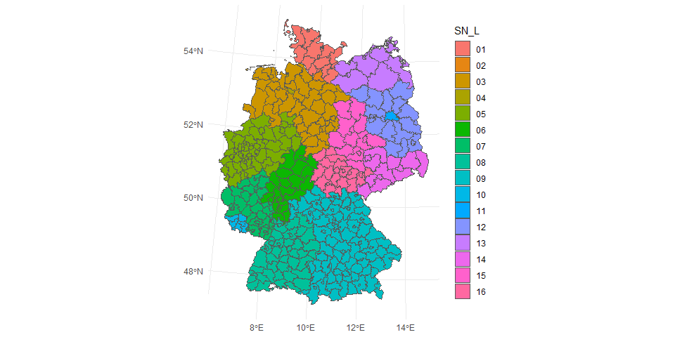

Agriculture in Germany: Simple Example for Geospatial Visualization
================
Juliane Manitz
30 September, 2024

<!-- ## Libraries and settings -->

## German District Polygon map

Source: <https://sgx.geodatenzentrum.de/wfs_vg5000_1231>; Deutsche
Verwaltungsgebiete VG5000

``` r
dtl <- st_read("data/vg5000_ebenen_0101/VG5000_KRS.shp")
```

    ## Reading layer `VG5000_KRS' from data source 
    ##   `C:\Users\navne\OneDrive\Desktop\Jule\Documents\Rpkgs\code-snippets\geospatial\data\vg5000_ebenen_0101\VG5000_KRS.shp' 
    ##   using driver `ESRI Shapefile'
    ## Simple feature collection with 400 features and 24 fields
    ## Geometry type: MULTIPOLYGON
    ## Dimension:     XY
    ## Bounding box:  xmin: 3280341 ymin: 5237533 xmax: 3921505 ymax: 6103301
    ## Projected CRS: DHDN / 3-degree Gauss-Kruger zone 3

``` r
# Centered around Berlin EPSG:3068 (just for fun, because I grew up there)
dtl_proj <- st_transform(dtl, crs = 3068)
plot(dtl_proj["geometry"], axes = TRUE, graticule = st_crs(dtl))
```

<!-- -->

``` r
# There is not much data in the data, but we can color-code the different states
ggplot(data = dtl_proj) +  
  geom_sf(aes(fill = SN_L)) +
  theme_minimal() 
```

<!-- -->

## Agricultural businesses in Germany 1999 - 2007;

Source: <https://www.regionalstatistik.de>; table 41120-01-02-4;
Landwirtschaftliche Betriebe und landwirtschaftlich genutzte Fläche (LF)
n. Kulturarten - Erhebungsjahr - regionale Tiefe: Kreise und krfr.
Städte

``` r
dt <- read.csv("data/41120-01-02-4.csv", sep=";", skip=9, na.strings = c("-","."), 
           col.names=c("year", "ARS", "name", "n_business", "ha_business", "n_farm", "ha_farm", "n_pcrop", "ha_pcrop", "n_grass", "ha_grass")) %>% 
  filter(year != ",,") %>% 
  # Factor handling 
  mutate_if(is.character, factor, exclude = c("", NA)) 
```

## Visualization

### Plot all agricultural data together

In addition to the cities if Berlin and Hamburg, it looks like there are
missings from two states in the north-east and east.

``` r
dtl07 <- dt %>% 
  # use 2007 data only
  filter(year == "2007") %>% 
  # match to map data
  left_join(dtl, ., by ="ARS") 

plot(dtl07[c("n_business", "ha_business", "n_farm", "ha_farm", "n_pcrop", "ha_pcrop", "n_grass", "ha_grass")], 
     logz = TRUE, border = "darkgray")
```

<!-- -->

### Plot farmland area over time

No obvious changes over time, probably requires appropriate
normalization

``` r
plot_farmland <- function(i){

  # subset data 
  dt %>% filter(year == i) %>% 
    # match to map data
    left_join(dtl, ., by ="ARS") %>% 
    # plot map
    ggplot(data = .) +  
    geom_sf(aes(fill = ha_farm/1000)) + scale_x_sqrt() +
    labs(title = paste0("Farmland area in ",i)) + 
    scale_fill_viridis() + theme_minimal()
}

pp <- lapply(levels(dt$year), plot_farmland)
ggpubr::ggarrange(plotlist=pp, legend= "right", common.legend = TRUE)
```

<!-- -->

# Session Information (for Reproducibility)

``` r
print(sessionInfo(), locale = FALSE)
```

    ## R version 4.4.1 (2024-06-14 ucrt)
    ## Platform: x86_64-w64-mingw32/x64
    ## Running under: Windows 11 x64 (build 22621)
    ## 
    ## Matrix products: default
    ## 
    ## 
    ## attached base packages:
    ## [1] stats     graphics  grDevices utils     datasets  methods   base     
    ## 
    ## other attached packages:
    ## [1] viridis_0.6.5     viridisLite_0.4.2 ggplot2_3.5.1     dplyr_1.1.4      
    ## [5] sf_1.0-17        
    ## 
    ## loaded via a namespace (and not attached):
    ##  [1] utf8_1.2.4         generics_0.1.3     tidyr_1.3.1        rstatix_0.7.2     
    ##  [5] class_7.3-22       KernSmooth_2.23-24 digest_0.6.37      magrittr_2.0.3    
    ##  [9] evaluate_0.24.0    grid_4.4.1         fastmap_1.2.0      backports_1.5.0   
    ## [13] e1071_1.7-14       DBI_1.2.3          gridExtra_2.3      purrr_1.0.2       
    ## [17] fansi_1.0.6        scales_1.3.0       abind_1.4-5        cli_3.6.3         
    ## [21] rlang_1.1.4        units_0.8-5        cowplot_1.1.3      munsell_0.5.1     
    ## [25] withr_3.0.1        yaml_2.3.10        tools_4.4.1        ggsignif_0.6.4    
    ## [29] colorspace_2.1-1   ggpubr_0.6.0       broom_1.0.6        vctrs_0.6.5       
    ## [33] R6_2.5.1           proxy_0.4-27       lifecycle_1.0.4    classInt_0.4-10   
    ## [37] car_3.1-2          pkgconfig_2.0.3    pillar_1.9.0       gtable_0.3.5      
    ## [41] glue_1.7.0         Rcpp_1.0.13        xfun_0.47          tibble_3.2.1      
    ## [45] tidyselect_1.2.1   highr_0.11         rstudioapi_0.16.0  knitr_1.48        
    ## [49] farver_2.1.2       htmltools_0.5.8.1  labeling_0.4.3     carData_3.0-5     
    ## [53] rmarkdown_2.28     compiler_4.4.1
