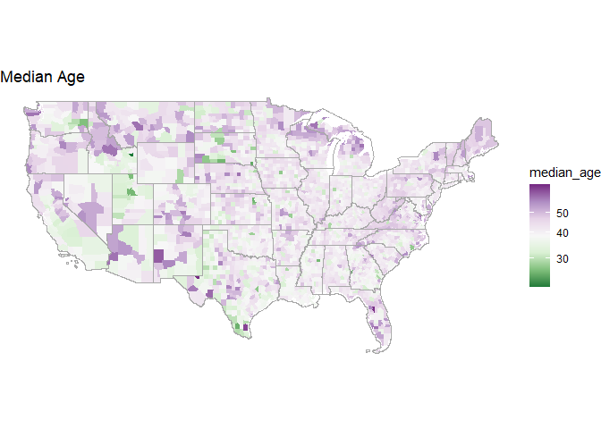
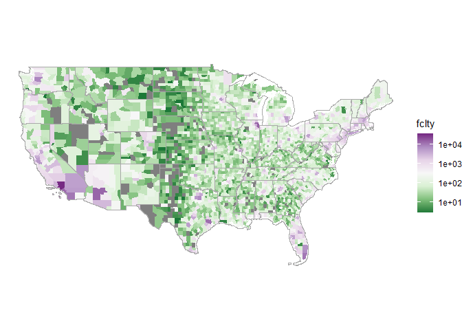
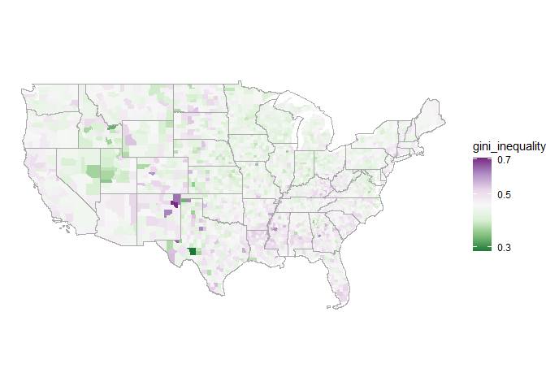
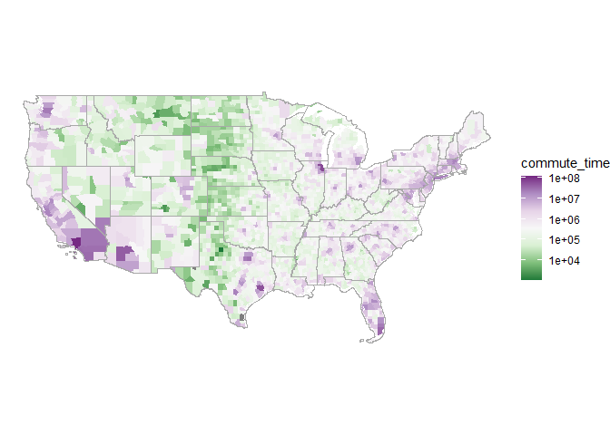
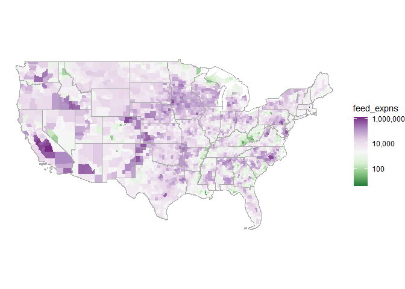
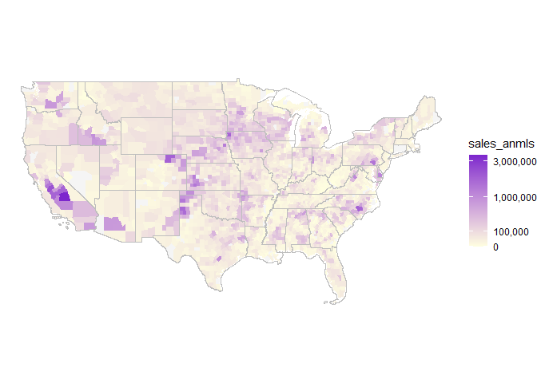

# Working with US Census Data
Juliane Manitz
2025-12-12

- [United States Map Shapefiles](#united-states-map-shapefiles)
- [American Community Survey](#american-community-survey)
  - [Example Plots](#example-plots)
- [Economic Census](#economic-census)
  - [Example: Healthcare Industry](#example-healthcare-industry)
- [USDA Census](#usda-census)
- [Combine Datasets](#combine-datasets)
- [Session Information](#session-information)

``` r
require(tidyverse)
require(stringr)
require(sf)

# Census Data API Handling 
require(tigris)     # Map Shapefiles
require(tidycensus) # US Census Data from ACS
require(censusapi)  # US Economic Census Data
require(tidyUSDA)   # USDA Census 

options(tigris_use_cache =TRUE)
source("../read_keys.R") # API keys
```

## United States Map Shapefiles

We are utilizing the `tigris` package, which provides a convenient way
to access and work with geographic data from the US Census Bureau,
specifically the TIGER/Line shapefiles (see
<https://www.census.gov/cgi-bin/geo/shapefiles/index.php> for details).

**States boundaries:** States and equivalent entities are the primary
governmental divisions of the US (reduced to mainland)

``` r
smap <- tigris::states(progress_bar = FALSE) |> 
  filter(!STATEFP %in% c("02","15","72","60","81","07","64","14","66","69","78")) 
```

**County boundaries:** Primary legal divisions such as US counties or
comparable (restricted to mainland)

``` r
cnty <- tigris::counties(filter_by = st_bbox(smap)) 
```

**ZIP codes**: Zip Code Tabulation Area (ZCTA) are generalized areal
representations of the United States Postal Service (USPS) ZIP codes
service areas.

``` r
zips <- tigris::zctas(progress_bar = FALSE)
```

**Highways**: Federal interstate highway system or under state
management. These highways are distinguished by the presence of
interchanges and are accessible by ramps and may include some toll
highways

``` r
hwy <- tigris::primary_roads(filter_by = st_bbox(smap), progress_bar = FALSE)
```

**Note:** Projection NAD83 (North American Datum 1983) = EPSG:4269

**Plot US Map with States, Counties and Highways**

``` r
ggplot() + theme_void() +    
  geom_sf(data = cnty, fill="Whitesmoke", color="lightgrey", lty=1) +   
  geom_sf(data = smap, color="Black", fill=NA) +    
  geom_sf(data = hwy, fill=NA, color="blue", lty=1) 
```


## American Community Survey

We use the `tidycensus` package that allows us to interface with a
select number of the US Census Bureau’s data APIs and return
tidyverse-ready data frames, optionally with simple feature geometry
included.

The American Community Survey (ACS) is an ongoing, mandatory survey by
the U.S. Census Bureau. Unlike the once-a-decade census, the ACS gathers
data every year. It surveys a sample of 3.5m households, asking about
social (education, language), demographic (age, race), economic (income,
employment), and housing (costs, internet access) characteristics.

<div class="panel-tabset">

#### Derived Variables

**Demographics**

- `pop_2023` Total Population in 2023
- `pop_density` Population density in 2023.
- `median_age` Median Age
- `born_citizen` Nativity and Citizenship Status, born in the United
  States

**Housing**

- `housing_units` Number of Housing Units
- `single_household` Proportion of Single person Household (Household
  size)

**Education**

- `school` Proportion population enrolled in school
- `higher_ed` Proportion population with higher education (Bachelor’s,
  Master’s, Professional School, Doctorate degree) for Population \> 25
  Years

**Income**

- `median_income` Median household income in the past 12 months (in 2023
  inflation-adjusted dollars)
- `gini_inequality` Gini Index of Income Inequality

**Commuting**

- `commute_time` Aggregate Travel Time to Work (in Minutes) of Worker
- `commute_carfree` Car-free Means of Transportation to Work: Public
  Transportation, Bicycle, Walked

#### Source Code

``` r
cnsdt <- get_acs(
  geography = "county", survey = "acs5", year = 2023, output="wide", geometry =TRUE, keep_geo_vars=TRUE,
  variables = c(
    # Demographics 
    "B01001_001", "B01002_001", "B05001_002",
    # Housing
    "B25001_001", "B11016_010", 
    # Education
    "B14001_002", "B15003_022", "B15003_023", "B15003_024", "B15003_025",
    # Income
    "B19013_001", "B19083_001", 
    # Commuting
    "B08006_001E", "B08006_008", "B08006_014", "B08006_015", "B08013_001"
  ), progress_bar = FALSE) |> 
  # Select Estimates
  select(GEOID, NAMELSAD, STUSPS, STATEFP, ALAND, B01001_001E, ends_with("E")) |> 
  # Calculate Variables
  transmute(
    geoid = GEOID, county = NAMELSAD, state = STATE_NAME, stateN = STATEFP,
    # Population
    pop_2023 = B01001_001E, 
    pop_density = pop_2023/(ALAND/2.59e+6),
    # Demographics
    median_age =    B01002_001E, 
    born_citizen = B05001_002E/pop_2023, 
    # Housing
    housing_units = B25001_001E, 
    single_household = B11016_010E/housing_units, 
    # Education
    school = B14001_002E/pop_2023, 
    higher_ed = (B15003_022E + B15003_023E + B15003_024E + B15003_025E)/pop_2023, 
     # Income
    median_income = B19013_001E, 
    gini_inequality = B19083_001E, 
    # Commuting
    commute_time = B08013_001E, 
    commute_carfree = (B08006_008E + B08006_014E + B08006_015E)/B08006_001E
  ) |> 
  # focus on US mainland only 
  filter(!stateN %in% c("02","15","72","60","81","07","64","14","66","69")) |> select(-stateN) |> 
  st_transform('EPSG:4269')
```

#### Source ACS Variables

**Demographics**

- B01001_001 = Total Population
- B01002_001 = Median Age
- B05001_002 = Nativity and Citizenship Status, born in the United
  States

**Housing**

- B25001_001 = Housing Units
- B11016_010 = Single person Household (Household size)

**Education**

- B14001_002 = Total enrolled in school
- B15003_022 = Bachelor’s degree for Population \> 25 Years
- B15003_023 = Master’s degree for Population \> 25 Years
- B15003_024 = Professional school degree for Population \> 25 Years
- B15003_025 = Doctorate degree for Population \> 25 Years

**Income**

- B19013_001 = Median household income in the past 12 months (in 2023
  inflation-adjusted dollars)
- B19083_001 = Gini Index of Income Inequality

**Commuting**

- B08006_008 = Means of Transportation to Work: Public Transportation
- B08006_014 = Means of Transportation to Work: Bicycle
- B08006_015 = Means of Transportation to Work: Walked
- B08013_001 = Aggregate Travel Time to Work (in Minutes) of Worker

See complete list of variables:
https://api.census.gov/data/2023/acs/acs5/variables.html

</div>

### Example Plots

<div class="panel-tabset">

#### Population

Total Population in 2023

``` r
ggplot() + theme_void() + 
  geom_sf(data = cnsdt, aes(fill=pop_2023), color=NA) +
  scale_fill_distiller(palette = "PRGn", trans="log10", direction = -1) + 
  geom_sf(data = smap, color="darkgray", fill=NA)
```



#### Median Age

Median Age

``` r
ggplot() + theme_void() + 
  geom_sf(data = cnsdt, aes(fill=median_age), color=NA) +
  scale_fill_distiller(palette = "PRGn", trans="log10", direction=-1) + 
  geom_sf(data = smap, color="darkgray", fill=NA)
```



#### Education

Proportion population with higher education (Bachelor’s, Master’s,
Professional School, Doctorate degree) for Population \> 25 Years

``` r
ggplot() + theme_void() + 
  geom_sf(data = cnsdt, aes(fill=higher_ed), color=NA) +
  scale_fill_distiller(palette = "PRGn", trans = "log10") + 
  geom_sf(data = smap, color="darkgray", fill=NA) 
```



#### Income

Gini Index of Income Inequality

``` r
ggplot() + theme_void() + 
  geom_sf(data = cnsdt, aes(fill=gini_inequality), color=NA) +
  scale_fill_distiller(palette = "PRGn", trans="log10", direction = -1) + 
  geom_sf(data = smap, color="darkgray", fill=NA)
```



#### Commuting

Aggregate Travel Time to Work (in Minutes) of Worker

``` r
ggplot() + theme_void() + 
  geom_sf(data = cnsdt, aes(fill=commute_time), color=NA) +
  scale_fill_distiller(palette = "PRGn", trans="log10", direction = -1) + 
  geom_sf(data = smap, color="darkgray", fill=NA)
```


</div>

## Economic Census

We retrieve data from the economic census using `censusapi`, which a
wrapper for the US Census Bureau APIs.

<div class="panel-tabset">

#### Select Variables

- time: YEAR
- location: GEO_ID, COUNTY, STATE, REGION,  
- business type:
  - NAICS2022
  - SECTOR,SUBSECTOR = NAICS economic sector
  - INDLEVEL, INDGROUP = Industry (Group)
- ESTAB (fclty) = number of establishments, refers to the count of
  individual physical business locations,
- EMP (emply) = number of employees
- RCPTOT (sales) = Sales, value of shipments, or revenue (\$1,000)

To filter industries of interest with NAICS Codes, we are using the
drill-down table (https://www.naics.com/search/#naics), e.g. NAICS Code
= 62 for healthcare industry

#### Source Code

``` r
# Select variables from economic census 
ecndt <- getCensus(
  name = "ecnbasic", vintage = 2022, region = "county:*", key = census_key, 
  vars = c("GEO_ID", "NAICS2022", "SECTOR", "SUBSECTOR", "INDLEVEL", "INDGROUP",
           "ESTAB", "EMP", "RCPTOT")) |> 
  # select utility businesses only
  filter(SECTOR == "62" & INDLEVEL == 2) |> 
  transmute(
    geoid = paste0(state, county),
    fclty = ESTAB |> as.numeric(), # Number of establishments
    emply = EMP |> as.numeric(),   # Number of employees
    sales = RCPTOT |> as.numeric() # Sales, value of shipments , or revenue ($1,000)  
  ) 
```

#### Other available APIs:

- cbp = County Business Patterns
- zbp = Zip Code Business Patterns:
- ewks = Economic Census - All Sectors: Economy-Wide Key Statistics
- ecnbasic = Economic Census: Summary Statistics for the U.S., States,
  and Selected Geographies: 2022
- ecntypop = Economic Census: Wholesale Trade: Detailed Type of
  Operation for the U.S.: 2022

</div>

### Example: Healthcare Industry

<div class="panel-tabset">

#### Facilities

Number of establishments, refers to the count of individual physical
business locations,

``` r
left_join(cnsdt, ecndt, by = 'geoid') |> 
  ggplot() + theme_void() + 
    geom_sf(aes(fill=fclty), color=NA) +
    scale_fill_distiller(palette = "PRGn", trans="log10", direction = -1) + 
    geom_sf(data = smap, color="darkgray", fill=NA)
```


#### Employees

Number of employees

``` r
left_join(cnsdt, ecndt, by = 'geoid') |> 
  ggplot() + theme_void() + 
    geom_sf(aes(fill=emply), color=NA) +
    scale_fill_distiller(palette = "PRGn", trans="log10", direction = -1) + 
    geom_sf(data = smap, color="darkgray", fill=NA)
```



#### Sales

Sales, value of shipments, or revenue (\$1,000)

``` r
left_join(cnsdt, ecndt, by = 'geoid') |> 
  ggplot() + theme_void() + 
    geom_sf(aes(fill=sales), color=NA) +
    scale_fill_distiller(palette = "PRGn", trans="log10", direction = -1) + 
    geom_sf(data = smap, color="darkgray", fill=NA)
```


</div>

## USDA Census

Part of the 2022 Economic Census data is conducted by USDA (NAICS 11 -
Agriculture, Forestry, Fishing and Hunting). We used the `tidyUSDA`
package, which is a tool for gathering USDA data for analysis and
visualization, providing an API to pull data from NASS QuickStats.

<div class="panel-tabset">

#### Derived Variables

- `farms` Number of farms with agricultural land, excluding cropland,
  pastureland and woodland
- `farms_acres` Acres of agricultural land, excluding cropland,
  pastureland and woodland
- `farms_anmls` Number of farms with animal sales, including products
- `sales_anmls` Total sales by farm animals and animal products
- `feed_expns` Feed expense, measured in \$

#### Source Code

``` r
vars <- c(
  "AG LAND, (EXCL CROPLAND & PASTURELAND & WOODLAND) - NUMBER OF OPERATIONS", 
  "AG LAND, (EXCL CROPLAND & PASTURELAND & WOODLAND) - ACRES", 
  "ANIMAL TOTALS, INCL PRODUCTS - OPERATIONS WITH SALES", 
  "ANIMAL TOTALS, INCL PRODUCTS - SALES, MEASURED IN $", 
  "FEED - EXPENSE, MEASURED IN $")

# Run API
out <- lapply(vars, FUN = function(x){
  getQuickstat(key = usda_key, program="CENSUS", data_item = x, geographic_level = "COUNTY", domain = "TOTAL", year = "2022") |> 
    select(state_ansi, county_code, short_desc, unit_desc, Value)
}) |> bind_rows()

usdadt <- out |> 
  transmute(
    geoid = paste0(state_ansi,county_code),
    desc = case_when(
      short_desc == "AG LAND, (EXCL CROPLAND & PASTURELAND & WOODLAND) - NUMBER OF OPERATIONS" ~ "farms",
      short_desc == "AG LAND, (EXCL CROPLAND & PASTURELAND & WOODLAND) - ACRES" ~ "farms_acres", 
      short_desc == "ANIMAL TOTALS, INCL PRODUCTS - OPERATIONS WITH SALES" ~ "farms_anmls", 
      short_desc == "ANIMAL TOTALS, INCL PRODUCTS - SALES, MEASURED IN $" ~ "sales_anmls", 
      short_desc == "FEED - EXPENSE, MEASURED IN $" ~ "feed_expns"),
    val = Value) |>  
  pivot_wider(id_cols = geoid, names_from = desc, values_from = val, values_fill = 0) |> 
  mutate_at(vars(starts_with(c("sales","feed")),), ~./1000) # sales in mm
```

#### USDA Source Variables

- Farms and Land in Farms: includes Number of Farms, Land in Farms,
  - AG LAND, (EXCL CROPLAND & PASTURELAND & WOODLAND) - NUMBER OF
    OPERATIONS
  - AG LAND, (EXCL CROPLAND & PASTURELAND & WOODLAND) - ACRES
- Livestock inventory
  - ANIMAL TOTALS, INCL PRODUCTS - OPERATIONS WITH SALES
  - ANIMAL TOTALS, INCL PRODUCTS - SALES, MEASURED IN \$
- Feed Expense
  - FEED - EXPENSE, MEASURED IN \$

See https://quickstats.nass.usda.gov, to view details on available
variables.

</div>

#### Example Plots

<div class="panel-tabset">

#### Number of Farms

``` r
left_join(cnsdt, usdadt, by = 'geoid') |> ggplot() + 
  geom_sf(aes(fill=farms), color=NA) +
  scale_fill_gradient(low="lightyellow", high="purple3", trans="sqrt", na.value="whitesmoke")+
  geom_sf(data = smap, color="darkgray", fill=NA) + theme_void()
```



#### Animal Product Sales

Total sales by farm animals and animal products

``` r
left_join(cnsdt, usdadt, by = 'geoid') |> ggplot() + 
  geom_sf(aes(fill=sales_anmls), color=NA) +
  scale_fill_gradient(low = "lightyellow", high = "purple3", na.value = "whitesmoke", trans="sqrt",
                      breaks=c(0,100000,1000000,3000000), labels=c("0","100,000","1,000,000","3,000,000"))+
  geom_sf(data = smap, color="gray", fill=NA) + theme_void()
```


#### Feed Expense

``` r
left_join(cnsdt, usdadt, by = 'geoid') |> ggplot() + 
  geom_sf(aes(fill=feed_expns), color=NA) +
  scale_fill_distiller(palette="PRGn", trans="log10", direction=-1, na.value="whitesmoke", 
                       breaks=c(100,10000,1000000), labels=c("100","10,000","1,000,000")) + 
  geom_sf(data = smap, color="darkgray", fill=NA) + theme_void()
```


</div>

## Combine Datasets

``` r
# Combine with census 
cnty <- purrr::reduce(list(cnsdt, ecndt, usdadt), dplyr::left_join, by = 'geoid')
```

## Session Information

``` r
sessionInfo()
```

    R version 4.5.2 (2025-10-31 ucrt)
    Platform: x86_64-w64-mingw32/x64
    Running under: Windows 11 x64 (build 26200)

    Matrix products: default
      LAPACK version 3.12.1

    locale:
    [1] LC_COLLATE=English_United States.utf8 
    [2] LC_CTYPE=English_United States.utf8   
    [3] LC_MONETARY=English_United States.utf8
    [4] LC_NUMERIC=C                          
    [5] LC_TIME=English_United States.utf8    

    time zone: America/New_York
    tzcode source: internal

    attached base packages:
    [1] stats     graphics  grDevices utils     datasets  methods   base     

    other attached packages:
     [1] tidyUSDA_0.4.1   censusapi_0.9.0  tidycensus_1.7.3 tigris_2.2.1    
     [5] sf_1.0-23        lubridate_1.9.4  forcats_1.0.1    stringr_1.6.0   
     [9] dplyr_1.1.4      purrr_1.2.0      readr_2.1.6      tidyr_1.3.1     
    [13] tibble_3.3.0     ggplot2_4.0.1    tidyverse_2.0.0 

    loaded via a namespace (and not attached):
     [1] rappdirs_0.3.3     generics_0.1.4     xml2_1.5.1         class_7.3-23      
     [5] KernSmooth_2.23-26 stringi_1.8.7      hms_1.1.4          digest_0.6.39     
     [9] magrittr_2.0.4     evaluate_1.0.5     grid_4.5.2         timechange_0.3.0  
    [13] RColorBrewer_1.1-3 fastmap_1.2.0      jsonlite_2.0.0     backports_1.5.0   
    [17] e1071_1.7-16       DBI_1.2.3          rvest_1.0.5        httr_1.4.7        
    [21] scales_1.4.0       codetools_0.2-20   cli_3.6.5          crayon_1.5.3      
    [25] rlang_1.1.6        units_1.0-0        withr_3.0.2        yaml_2.3.11       
    [29] tools_4.5.2        uuid_1.2-1         tzdb_0.5.0         checkmate_2.3.3   
    [33] curl_7.0.0         vctrs_0.6.5        R6_2.6.1           proxy_0.4-27      
    [37] lifecycle_1.0.4    classInt_0.4-11    pkgconfig_2.0.3    pillar_1.11.1     
    [41] gtable_0.3.6       glue_1.8.0         Rcpp_1.1.0         xfun_0.54         
    [45] tidyselect_1.2.1   rstudioapi_0.17.1  knitr_1.50         farver_2.1.2      
    [49] htmltools_0.5.9    labeling_0.4.3     rmarkdown_2.30     compiler_4.5.2    
    [53] S7_0.2.1          
