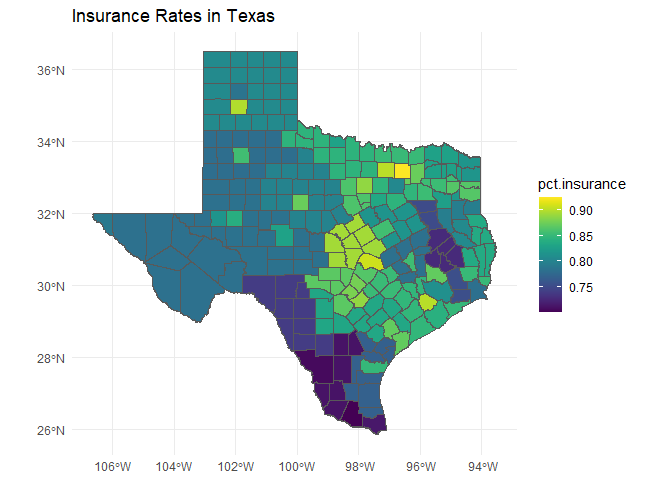
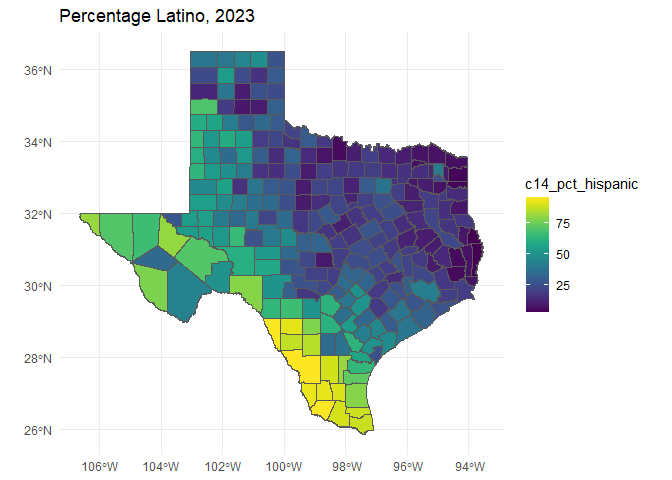
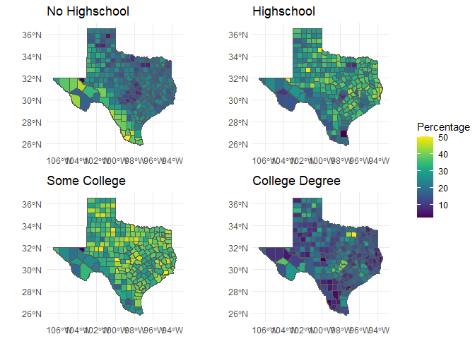
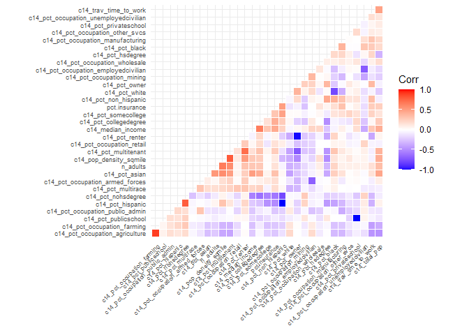
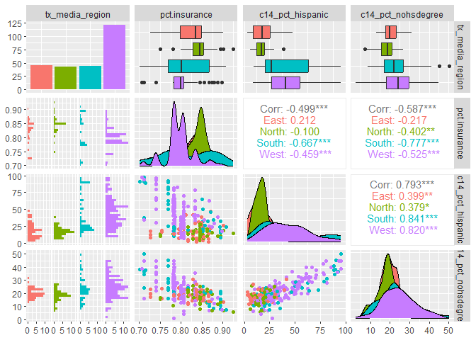
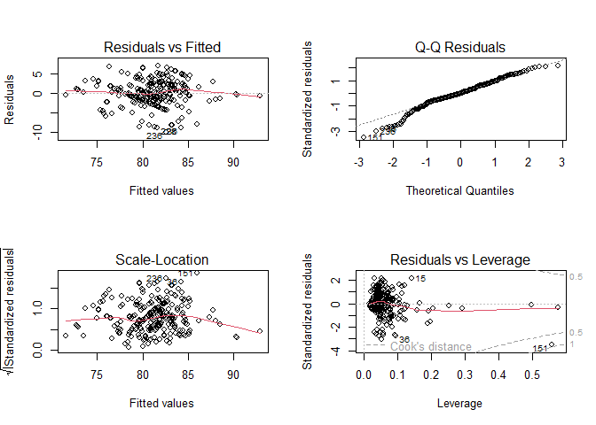
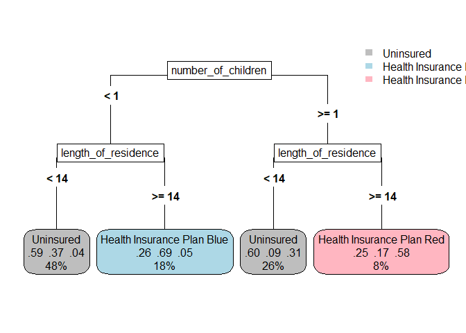

General Data Science Analytics Exam
================
Juliane Manitz
2024-09-30

# Initialization

## Libraries and settings

``` r
# Load libraries 
library(tidyverse)
library(dplyr)
library(stringr)

library(viridis)
library(gt)
library(gtsummary)

library(recipes)
library(tidymodels)
library(glmnet)
```

## Helper Funtions

``` r
# Helper function to combine binary variable into one categorical factor
combine_fct <- function(data, x){
  #'@param data <- dt2 ... data frame
  #'@param x <- "ethnicity" ... group of binary variables selected by 'starts_with'
  #' Be aware, this function is only fit for purpose and needs better testing
  
  dtx <- data %>% select(starts_with(x)) 
  nn <- colnames(dtx) %>% str_split_i("_",2)
  data[,x] <- data.frame(dtx %>% interaction() %>% droplevels() %>% factor(labels = nn))
  return(data)
}
```

## Read and Prepare Data

### County-level Data

``` r
tx_smry <- read.csv("Data Exam 2023 Data/tx_county_summary.csv", sep=",") %>% 
  rename(idn = censuskey)
rgn <- read.csv("Data Exam 2023 Data/county_to_media_region.csv", sep=",") %>% 
  mutate(county_name = toupper(demo_county_name))
tx_insr <- read.csv("Data Exam 2023 Data/tx_county_insurance_rates.csv", sep=",") %>% 
  rename(idn = county)

# combine data 
tx_smry2 <- left_join(tx_smry, rgn, by = "county_name")
tx_data <- left_join(tx_insr, tx_smry2, by = "idn") %>% 
  mutate_if(is.character, as.factor)
```

<!-- ```{r} -->
<!-- tx_data %>% select(c14_pct_hispanic, c14_pct_non_hispanic) %>% rowSums() %>% summary() -->
<!-- tx_data %>% select(c14_pct_white, c14_pct_black, c14_pct_asian, c14_pct_multirace) %>% rowSums() %>% summary() -->
<!-- tx_data %>% select(c14_pct_nohsdegree, c14_pct_hsdegree, c14_pct_somecollege, c14_pct_collegedegree) %>% rowSums() %>% summary() -->
<!-- tx_data %>% select(c14_pct_publicschool, c14_pct_privateschool) %>% rowSums() %>% summary() -->
<!-- ``` -->

**Notes:**

- Most Variables sum up to 100% (hispanic vs. non-hispanic, education
  variables, private vs. public school)
- Race percentages do not sum up to 100%, i.e. must have ‘others’
  category,
- Education variables seems to represent *highest* education

### Add Map Information

``` r
# Download shape file using 'tidycensus', which should work if located in the US
# tx_map <- tidycensus::get_acs(state = "TX", geography = "county", variables = "B19013_001", year = 2023, geometry = TRUE)

# This works outside the US !! make sure VPN is on!! 
tx_map <- tigris::counties("TX", , progress_bar = FALSE) %>% mutate(idn = as.numeric(GEOID)) %>% 
  left_join(., tx_data, by ="idn")
```

    ## Retrieving data for the year 2022

### Individual-Level Data

``` r
## Training Data 
dt_train <- read.csv("Data Exam 2023 Data/ds_test_training_dataset_2023.csv", 
                     sep=",", na.strings = "") %>% 
  head(., -1)  %>% # last row is corrupted 
  # data wrangling 
  mutate(health_insurance = factor(health_insurance) %>% relevel(ref = "Uninsured")) %>% 
  mutate(level_of_education = factor(level_of_education) %>% relevel(ref = "no hs degree")) %>% 
  mutate_at(.vars = c("age", "number_of_children", "has_children"), .fun = as.numeric) %>% 
  mutate_at(.vars = c("is_homeowner", "is_renter", "has_a_cat"), .funs = ~as.numeric(. == "1")) %>% 
  mutate(across(starts_with(c("gender_","maritalstatus", "religion", "donor","occupation","interests","purchases", "ethnicity")), ~as.numeric(. == "1"))) %>% 
  # select variables of interest
  select(health_insurance, gender, political_party, age, income,  
         length_of_residence, number_of_children, level_of_education, 
         is_homeowner, has_a_cat, # is_renter,
         starts_with(c("gender","maritalstatus","religion","donor","occupation","interests","purchases", "ethnicity")))  

## Test Data 
dt_test <- read.csv("Data Exam 2023 Data/ds_test_houston_2023.csv", sep=",") %>% 
    mutate_at(.vars = c("age", "number_of_children", "has_children"), .fun = as.numeric)
```

# Question 1

Your Data Science has been doing some initial investigation into the
data and presenting some initial findings. Two of your colleagues are
disagreeing. One says Latinos are less likely to be insured, the other
says that people with lower educational achievement are less likely to
be insured. How would you explain your best answer to this question?

## Descriptive Analysis

Get some initial insights into the data using different summaries and
visualizations.

<!-- # install.packages("skimr") <TODO> -->

``` r
skimr::skim(tx_data)
```

### Spatial Variation

``` r
# Variable of Interest: Insurance rates
ggplot(data = tx_map) +  
  geom_sf(aes(fill = pct.insurance)) +
  labs(title = "Insurance Rates in Texas") + 
  scale_fill_viridis() + theme_minimal() 
```

<!-- -->

``` r
# Covariate Latino
ggplot(data = tx_map) +  
  geom_sf(aes(fill = c14_pct_hispanic)) +
  labs(title = "Percentage Latino, 2023") + 
  scale_fill_viridis() + theme_minimal() 
```

<!-- -->

``` r
# Covariates for Education
ed1 <- ggplot(data = tx_map) +  
  geom_sf(aes(fill = c14_pct_nohsdegree)) +
  labs(title = "No Highschool", fill="Percentage") +
  scale_fill_viridis() + theme_minimal() 
ed2 <- ggplot(data = tx_map) +  
  geom_sf(aes(fill = c14_pct_hsdegree)) +
  labs(title = "Highschool") + 
  scale_fill_viridis() + theme_minimal() 
ed3 <- ggplot(data = tx_map) +  
  geom_sf(aes(fill = c14_pct_somecollege)) +
  labs(title = "Some College") + 
  scale_fill_viridis() + theme_minimal() 
ed4 <- ggplot(data = tx_map) +  
  geom_sf(aes(fill = c14_pct_collegedegree)) +
  labs(title = "College Degree") + 
  scale_fill_viridis() + theme_minimal() 
ggpubr::ggarrange(plotlist=list(ed1, ed2, ed3, ed4), legend= "right", common.legend = TRUE)
```

<!-- -->

**Conclusion:**

- There is quite some spatial variation in the variables of interest
  that needs to be considered

### Correlation Analysis

Exploration of correlation between covariates

``` r
tx_data %>%
  select(pct.insurance, n_adults, starts_with("c14")) %>% 
  cor() %>% 
  ggcorrplot::ggcorrplot(., hc.order = TRUE, type = "lower", outline.color = "white", pch.cex = 1, tl.cex=7)
```

<!-- -->

``` r
# selected covariates
tx_data %>% 
  select(tx_media_region, pct.insurance, c14_pct_hispanic, c14_pct_nohsdegree) %>% 
  GGally::ggpairs(ggplot2::aes(color=stringr::str_split_i(tx_media_region, " ", 1)))
```

<!-- -->

**Conclusions:**

- It looks like there is a quite strong correlation between percentage
  of Latinos and percentage without high school degree in a county.
- Other Variables such as median income and no highschool degree, or
  population density and multitentant housing correlate as well .
- There is also some spatial variation that needs to be considered

**Comments of statistical caution:**

- Statistical significance in the correlation analysis is only meant to
  be used for exploration, statistical inference conclusions require
  multiple testing adjustments

## Some Exploratory Regression Analyses

### Using County-Level Data

Running a simple linear regression using demographics using county-level
data.

``` r
# Full model for sensitivity analysis only 
# m1 <- tx_data %>% 
#    select(pct.insurance, n_adults, starts_with("c14")) %>% 
#    lm(pct.insurance ~ ., data = .) 
 
# Subset of covariates that are relevant for the question of interest
m2 <- tx_data %>% 
  select(pct.insurance, n_adults, c14_pop_density_sqmile, tx_media_region, c14_median_income, 
         c14_pct_hispanic, c14_pct_white, c14_pct_black, c14_pct_asian, c14_pct_multirace, 
         c14_pct_nohsdegree, c14_pct_hsdegree, c14_pct_somecollege, c14_pct_collegedegree, 
         c14_pct_privateschool) %>% 
  lm(I(pct.insurance*100) ~ ., data = .) 

#tbl_regression(m2)
summary(m2)
```

    ## 
    ## Call:
    ## lm(formula = I(pct.insurance * 100) ~ ., data = .)
    ## 
    ## Residuals:
    ##    Min     1Q Median     3Q    Max 
    ## -9.910 -1.695 -0.050  2.127  7.057 
    ## 
    ## Coefficients:
    ##                              Estimate Std. Error t value Pr(>|t|)    
    ## (Intercept)                 1.131e+02  1.434e+01   7.889 1.11e-13 ***
    ## n_adults                   -2.157e-06  1.663e-06  -1.297  0.19590    
    ## c14_pop_density_sqmile      5.575e-04  2.839e-04   1.964  0.05072 .  
    ## tx_media_regionNorth Texas  1.090e+00  8.587e-01   1.270  0.20545    
    ## tx_media_regionSouth Texas  5.005e-01  8.567e-01   0.584  0.55964    
    ## tx_media_regionWest Texas  -1.265e+00  8.738e-01  -1.448  0.14896    
    ## c14_median_income           4.152e-05  3.268e-05   1.271  0.20506    
    ## c14_pct_hispanic           -7.533e-02  2.478e-02  -3.040  0.00263 ** 
    ## c14_pct_white              -2.065e-01  6.312e-02  -3.271  0.00123 ** 
    ## c14_pct_black              -2.734e-01  8.743e-02  -3.127  0.00199 ** 
    ## c14_pct_asian               1.476e-01  2.233e-01   0.661  0.50932    
    ## c14_pct_multirace          -4.343e-01  3.826e-01  -1.135  0.25743    
    ## c14_pct_nohsdegree         -2.445e-01  1.322e-01  -1.849  0.06572 .  
    ## c14_pct_hsdegree           -7.118e-02  1.285e-01  -0.554  0.58007    
    ## c14_pct_somecollege        -1.428e-01  1.320e-01  -1.081  0.28063    
    ## c14_pct_collegedegree      -6.370e-02  1.667e-01  -0.382  0.70267    
    ## c14_pct_privateschool      -3.851e-02  3.941e-02  -0.977  0.32943    
    ## ---
    ## Signif. codes:  0 '***' 0.001 '**' 0.01 '*' 0.05 '.' 0.1 ' ' 1
    ## 
    ## Residual standard error: 3.366 on 237 degrees of freedom
    ## Multiple R-squared:  0.4674, Adjusted R-squared:  0.4314 
    ## F-statistic:    13 on 16 and 237 DF,  p-value: < 2.2e-16

``` r
par(mfrow=c(2,2)); plot(m2) # model checks look alright 
```

<!-- -->

**Conclusions:**

From the multivariable model using the county-level data, we see that
both variables, high proportion of Latinos and no highschool, may have
some effect on the insurance rate in the county. When controlling for
both effects in the same model, it seems that ethnicity may have a
stronger effect.

**Comments of statistical caution:**

- Ecological fallacy: It is important to point out that a
  county/group-level relationship does not automatically characterize
  the relationship at the level of the individual. Thus, districts with
  higher rate of Latinos tend to have higher rate of insurance. It is
  wrong to conclude that Latinos are the ones with/without insurance. A
  conclusion like that requires analysis at the individual level

- Base ratio fallacy: Note that using ratios in regression analysis can
  lead to incorrect or misleading conclusions, because it ignores the
  base rate/general prevalence.

### Individual-Level data

Running a simple logistic regression using demographics at indidividual
level.

``` r
# Simple logistic regression modelling n individual level
m3 <- dt_train %>% 
  combine_fct(., "ethnicity") %>% 
  select(health_insurance, political_party, age, income,  
         length_of_residence, number_of_children, level_of_education, ethnicity,  
         starts_with(c("gender_", "maritalstatus","religion"))) %>% 
  glm(I(health_insurance != "Uninsured") ~ ., data= ., family = "binomial")

#tbl_regression(m3, exp=TRUE)
summary(m3)
```

    ## 
    ## Call:
    ## glm(formula = I(health_insurance != "Uninsured") ~ ., family = "binomial", 
    ##     data = .)
    ## 
    ## Coefficients:
    ##                                   Estimate Std. Error z value Pr(>|z|)    
    ## (Intercept)                     -3.253e+00  1.536e+00  -2.118  0.03417 *  
    ## political_partyI                -1.522e-01  8.187e-02  -1.859  0.06304 .  
    ## political_partyR                 3.905e-01  6.553e-02   5.958 2.55e-09 ***
    ## age                              1.624e-02  2.102e-03   7.729 1.08e-14 ***
    ## income                           1.508e-02  9.588e-04  15.727  < 2e-16 ***
    ## length_of_residence              1.475e-01  5.868e-03  25.142  < 2e-16 ***
    ## number_of_children              -6.283e-03  2.563e-02  -0.245  0.80637    
    ## level_of_educationbach degree    2.761e-01  9.814e-02   2.813  0.00491 ** 
    ## level_of_educationhigh school    1.561e-01  9.490e-02   1.644  0.10007    
    ## level_of_educationpost graduate  2.907e-01  1.157e-01   2.512  0.01200 *  
    ## level_of_educationsome college   2.089e-01  9.162e-02   2.280  0.02261 *  
    ## ethnicitylatino                 -2.025e-01  9.004e-02  -2.249  0.02451 *  
    ## ethnicityasian                  -1.200e-01  1.825e-01  -0.658  0.51084    
    ## ethnicitywhite                  -4.550e-02  8.341e-02  -0.546  0.58538    
    ## ethnicityother                  -1.273e+01  1.195e+02  -0.107  0.91516    
    ## gender_female                   -5.739e-01  1.527e+00  -0.376  0.70705    
    ## gender_male                     -5.861e-01  1.527e+00  -0.384  0.70108    
    ## maritalstatus_single            -1.754e-01  3.725e-01  -0.471  0.63769    
    ## maritalstatus_married           -9.650e-02  3.693e-01  -0.261  0.79383    
    ## religion_catholic               -9.381e-02  6.752e-02  -1.389  0.16471    
    ## religion_christian              -2.611e-02  1.288e-01  -0.203  0.83934    
    ## ---
    ## Signif. codes:  0 '***' 0.001 '**' 0.01 '*' 0.05 '.' 0.1 ' ' 1
    ## 
    ## (Dispersion parameter for binomial family taken to be 1)
    ## 
    ##     Null deviance: 10342.6  on 7460  degrees of freedom
    ## Residual deviance:  9071.1  on 7440  degrees of freedom
    ## AIC: 9113.1
    ## 
    ## Number of Fisher Scoring iterations: 9

**Conclusions**

The multivariable model at the individual level confirms that both
variables. Latinos and people without high school degree are less likely
to be insured. Both variables are highly correlated. Additional analysis
should consider spatial effects.

# ——————————————————————————

# Question 2

The company is now given the opportunity to expand into the Houston
media market. For the sake of this exercise, assume no one in the
Houston media market has insurance currently but their behaviors
resemble that of the rest of the state. The county insurance rate table
does include Houston media market counties but those can be ignored
here. Using the data available to you, construct a targeting strategy to
maximize the number of people that will receive insurance. You can
assume that you will be able to do outreach at the individual level.

There are two deliverables for this work. First, prepare release notes
for internal stakeholders in your organization, including non-technical
personnel. Please include relevant information on how to use the score
effectively as well as any relevant validation. Separately include a
file ranking the 2,500 provided people in the Houston media market for
outreach.

## Data Summary

``` r
dt_train %>% 
  tbl_summary(by = health_insurance, percent = "row") %>% add_overall()
```

## Recursive Partitioning

Quick Exploration of possible predictors using recursive partitioning,
which creates a decision tree that splits the population into subgroups
based on several dichotomous decisions. This is a data-driven, simple
assessment that mirrors human decision making and can be easily
explained to non-technical audiences.

``` r
rpart_res <- dt_train %>% rpart::rpart(health_insurance ~ ., data=., model=TRUE)
rpart.plot::rpart.plot(rpart_res, extra=104, type=5, box.palette=list("grey", "lightblue", "lightpink"))
```

<!-- -->

**Conclusions:**

Most relevant variables that predict the health insurance plan choice
are: 1) person is having children (no/yes) 2) length of residence
(Less/more than 14 years)

Based on this simple analysis, a construction of a targeting strategy to
maximize the number of people that will receive insurance should include
whether the person has children or not. If the person has residence for
more than 14 years, they are likely to purchase health insurance.

## Machine Learning Modelling

For more complex analysis, we apply machine learning modelling using
tidymodels. For multinomial classification regression different options
are available:

``` r
show_engines("multinom_reg")
```

    ## # A tibble: 5 × 2
    ##   engine mode          
    ##   <chr>  <chr>         
    ## 1 glmnet classification
    ## 2 spark  classification
    ## 3 keras  classification
    ## 4 nnet   classification
    ## 5 brulee classification

``` r
# Define recipe for multinomial regression
dt_recipe <- dt_train %>% 
  recipe(health_insurance ~ .) %>% 
  # execute transformation
  prep()
train_dt <- juice(dt_recipe)

# Apply pre-processing to test data 
test_dt <- dt_test %>% 
  bake(dt_recipe, new_data = .) %>% as.data.frame()
```

For illustration purposes, we choose elastic net regression as the
penalization properties nicely allow variable selection. In the example
on hand, this allows the construction of a simplified targeting score,
i.e. including a small number of variables.  
We choose the penalty to be 95% lasso and 5% weight decay via ridge.
Thus we strongly focus on variable selection via lasso as it shrinks the
model effects to zero so that their effect are entirely removed from the
model.

``` r
# Model specification and fit 
model_spec <- multinom_reg(mode = "classification", engine = "glmnet", 
                           penalty = 0.05, mixture = 0.95)
enet_fit <- model_spec %>% 
  fit(health_insurance ~ ., data = train_dt)

# Model coefficients 
tidy(enet_fit) %>% select(-penalty) %>% 
  filter(estimate != 0 & term != "(Intercept)") 
```

    ## # A tibble: 6 × 3
    ##   class                      term                estimate
    ##   <chr>                      <chr>                  <dbl>
    ## 1 Uninsured                  political_partyR    -0.130  
    ## 2 Uninsured                  age                 -0.00184
    ## 3 Uninsured                  income              -0.00687
    ## 4 Uninsured                  length_of_residence -0.0939 
    ## 5 Health Insurance Plan Blue number_of_children  -0.369  
    ## 6 Health Insurance Plan Red  number_of_children   0.396

``` r
#%>% gt() %>% fmt_number(decimals=3)
```

**Conclusions**:

- Number of children remains the most relevant variables to
  differentiate between Plan Blue and Red. Thus the targeted marketing
  strategy should focus on that factor
- Additional variables that may explain decisions whether or not an
  insurance is chosen include: Length of residence, income, age and
  political party affilination as republican

**Comments of statistical caution:**

Model validation pending. More comprehensive analysis could result in a
more refined model, which can be obtained by tuning of the model
parameters. In addition, it is advised to conduct benchmarking with
other approaches.

## Prediction for Houston media market

``` r
pred <- bind_cols(
  rpart_class = predict(rpart_res, dt_test, type = "class" ),
  # predict(rpart_res, dt_test, type="prob")
  predict(enet_fit, test_dt),
  predict(enet_fit, test_dt, type = "prob")
  ) 
# compare predictions from both methods
tbl_cross(pred, row = .pred_class, col=rpart_class)
```

<div id="khshscvkyd" style="padding-left:0px;padding-right:0px;padding-top:10px;padding-bottom:10px;overflow-x:auto;overflow-y:auto;width:auto;height:auto;">
<style>#khshscvkyd table {
  font-family: system-ui, 'Segoe UI', Roboto, Helvetica, Arial, sans-serif, 'Apple Color Emoji', 'Segoe UI Emoji', 'Segoe UI Symbol', 'Noto Color Emoji';
  -webkit-font-smoothing: antialiased;
  -moz-osx-font-smoothing: grayscale;
}
&#10;#khshscvkyd thead, #khshscvkyd tbody, #khshscvkyd tfoot, #khshscvkyd tr, #khshscvkyd td, #khshscvkyd th {
  border-style: none;
}
&#10;#khshscvkyd p {
  margin: 0;
  padding: 0;
}
&#10;#khshscvkyd .gt_table {
  display: table;
  border-collapse: collapse;
  line-height: normal;
  margin-left: auto;
  margin-right: auto;
  color: #333333;
  font-size: 16px;
  font-weight: normal;
  font-style: normal;
  background-color: #FFFFFF;
  width: auto;
  border-top-style: solid;
  border-top-width: 2px;
  border-top-color: #A8A8A8;
  border-right-style: none;
  border-right-width: 2px;
  border-right-color: #D3D3D3;
  border-bottom-style: solid;
  border-bottom-width: 2px;
  border-bottom-color: #A8A8A8;
  border-left-style: none;
  border-left-width: 2px;
  border-left-color: #D3D3D3;
}
&#10;#khshscvkyd .gt_caption {
  padding-top: 4px;
  padding-bottom: 4px;
}
&#10;#khshscvkyd .gt_title {
  color: #333333;
  font-size: 125%;
  font-weight: initial;
  padding-top: 4px;
  padding-bottom: 4px;
  padding-left: 5px;
  padding-right: 5px;
  border-bottom-color: #FFFFFF;
  border-bottom-width: 0;
}
&#10;#khshscvkyd .gt_subtitle {
  color: #333333;
  font-size: 85%;
  font-weight: initial;
  padding-top: 3px;
  padding-bottom: 5px;
  padding-left: 5px;
  padding-right: 5px;
  border-top-color: #FFFFFF;
  border-top-width: 0;
}
&#10;#khshscvkyd .gt_heading {
  background-color: #FFFFFF;
  text-align: center;
  border-bottom-color: #FFFFFF;
  border-left-style: none;
  border-left-width: 1px;
  border-left-color: #D3D3D3;
  border-right-style: none;
  border-right-width: 1px;
  border-right-color: #D3D3D3;
}
&#10;#khshscvkyd .gt_bottom_border {
  border-bottom-style: solid;
  border-bottom-width: 2px;
  border-bottom-color: #D3D3D3;
}
&#10;#khshscvkyd .gt_col_headings {
  border-top-style: solid;
  border-top-width: 2px;
  border-top-color: #D3D3D3;
  border-bottom-style: solid;
  border-bottom-width: 2px;
  border-bottom-color: #D3D3D3;
  border-left-style: none;
  border-left-width: 1px;
  border-left-color: #D3D3D3;
  border-right-style: none;
  border-right-width: 1px;
  border-right-color: #D3D3D3;
}
&#10;#khshscvkyd .gt_col_heading {
  color: #333333;
  background-color: #FFFFFF;
  font-size: 100%;
  font-weight: normal;
  text-transform: inherit;
  border-left-style: none;
  border-left-width: 1px;
  border-left-color: #D3D3D3;
  border-right-style: none;
  border-right-width: 1px;
  border-right-color: #D3D3D3;
  vertical-align: bottom;
  padding-top: 5px;
  padding-bottom: 6px;
  padding-left: 5px;
  padding-right: 5px;
  overflow-x: hidden;
}
&#10;#khshscvkyd .gt_column_spanner_outer {
  color: #333333;
  background-color: #FFFFFF;
  font-size: 100%;
  font-weight: normal;
  text-transform: inherit;
  padding-top: 0;
  padding-bottom: 0;
  padding-left: 4px;
  padding-right: 4px;
}
&#10;#khshscvkyd .gt_column_spanner_outer:first-child {
  padding-left: 0;
}
&#10;#khshscvkyd .gt_column_spanner_outer:last-child {
  padding-right: 0;
}
&#10;#khshscvkyd .gt_column_spanner {
  border-bottom-style: solid;
  border-bottom-width: 2px;
  border-bottom-color: #D3D3D3;
  vertical-align: bottom;
  padding-top: 5px;
  padding-bottom: 5px;
  overflow-x: hidden;
  display: inline-block;
  width: 100%;
}
&#10;#khshscvkyd .gt_spanner_row {
  border-bottom-style: hidden;
}
&#10;#khshscvkyd .gt_group_heading {
  padding-top: 8px;
  padding-bottom: 8px;
  padding-left: 5px;
  padding-right: 5px;
  color: #333333;
  background-color: #FFFFFF;
  font-size: 100%;
  font-weight: initial;
  text-transform: inherit;
  border-top-style: solid;
  border-top-width: 2px;
  border-top-color: #D3D3D3;
  border-bottom-style: solid;
  border-bottom-width: 2px;
  border-bottom-color: #D3D3D3;
  border-left-style: none;
  border-left-width: 1px;
  border-left-color: #D3D3D3;
  border-right-style: none;
  border-right-width: 1px;
  border-right-color: #D3D3D3;
  vertical-align: middle;
  text-align: left;
}
&#10;#khshscvkyd .gt_empty_group_heading {
  padding: 0.5px;
  color: #333333;
  background-color: #FFFFFF;
  font-size: 100%;
  font-weight: initial;
  border-top-style: solid;
  border-top-width: 2px;
  border-top-color: #D3D3D3;
  border-bottom-style: solid;
  border-bottom-width: 2px;
  border-bottom-color: #D3D3D3;
  vertical-align: middle;
}
&#10;#khshscvkyd .gt_from_md > :first-child {
  margin-top: 0;
}
&#10;#khshscvkyd .gt_from_md > :last-child {
  margin-bottom: 0;
}
&#10;#khshscvkyd .gt_row {
  padding-top: 8px;
  padding-bottom: 8px;
  padding-left: 5px;
  padding-right: 5px;
  margin: 10px;
  border-top-style: solid;
  border-top-width: 1px;
  border-top-color: #D3D3D3;
  border-left-style: none;
  border-left-width: 1px;
  border-left-color: #D3D3D3;
  border-right-style: none;
  border-right-width: 1px;
  border-right-color: #D3D3D3;
  vertical-align: middle;
  overflow-x: hidden;
}
&#10;#khshscvkyd .gt_stub {
  color: #333333;
  background-color: #FFFFFF;
  font-size: 100%;
  font-weight: initial;
  text-transform: inherit;
  border-right-style: solid;
  border-right-width: 2px;
  border-right-color: #D3D3D3;
  padding-left: 5px;
  padding-right: 5px;
}
&#10;#khshscvkyd .gt_stub_row_group {
  color: #333333;
  background-color: #FFFFFF;
  font-size: 100%;
  font-weight: initial;
  text-transform: inherit;
  border-right-style: solid;
  border-right-width: 2px;
  border-right-color: #D3D3D3;
  padding-left: 5px;
  padding-right: 5px;
  vertical-align: top;
}
&#10;#khshscvkyd .gt_row_group_first td {
  border-top-width: 2px;
}
&#10;#khshscvkyd .gt_row_group_first th {
  border-top-width: 2px;
}
&#10;#khshscvkyd .gt_summary_row {
  color: #333333;
  background-color: #FFFFFF;
  text-transform: inherit;
  padding-top: 8px;
  padding-bottom: 8px;
  padding-left: 5px;
  padding-right: 5px;
}
&#10;#khshscvkyd .gt_first_summary_row {
  border-top-style: solid;
  border-top-color: #D3D3D3;
}
&#10;#khshscvkyd .gt_first_summary_row.thick {
  border-top-width: 2px;
}
&#10;#khshscvkyd .gt_last_summary_row {
  padding-top: 8px;
  padding-bottom: 8px;
  padding-left: 5px;
  padding-right: 5px;
  border-bottom-style: solid;
  border-bottom-width: 2px;
  border-bottom-color: #D3D3D3;
}
&#10;#khshscvkyd .gt_grand_summary_row {
  color: #333333;
  background-color: #FFFFFF;
  text-transform: inherit;
  padding-top: 8px;
  padding-bottom: 8px;
  padding-left: 5px;
  padding-right: 5px;
}
&#10;#khshscvkyd .gt_first_grand_summary_row {
  padding-top: 8px;
  padding-bottom: 8px;
  padding-left: 5px;
  padding-right: 5px;
  border-top-style: double;
  border-top-width: 6px;
  border-top-color: #D3D3D3;
}
&#10;#khshscvkyd .gt_last_grand_summary_row_top {
  padding-top: 8px;
  padding-bottom: 8px;
  padding-left: 5px;
  padding-right: 5px;
  border-bottom-style: double;
  border-bottom-width: 6px;
  border-bottom-color: #D3D3D3;
}
&#10;#khshscvkyd .gt_striped {
  background-color: rgba(128, 128, 128, 0.05);
}
&#10;#khshscvkyd .gt_table_body {
  border-top-style: solid;
  border-top-width: 2px;
  border-top-color: #D3D3D3;
  border-bottom-style: solid;
  border-bottom-width: 2px;
  border-bottom-color: #D3D3D3;
}
&#10;#khshscvkyd .gt_footnotes {
  color: #333333;
  background-color: #FFFFFF;
  border-bottom-style: none;
  border-bottom-width: 2px;
  border-bottom-color: #D3D3D3;
  border-left-style: none;
  border-left-width: 2px;
  border-left-color: #D3D3D3;
  border-right-style: none;
  border-right-width: 2px;
  border-right-color: #D3D3D3;
}
&#10;#khshscvkyd .gt_footnote {
  margin: 0px;
  font-size: 90%;
  padding-top: 4px;
  padding-bottom: 4px;
  padding-left: 5px;
  padding-right: 5px;
}
&#10;#khshscvkyd .gt_sourcenotes {
  color: #333333;
  background-color: #FFFFFF;
  border-bottom-style: none;
  border-bottom-width: 2px;
  border-bottom-color: #D3D3D3;
  border-left-style: none;
  border-left-width: 2px;
  border-left-color: #D3D3D3;
  border-right-style: none;
  border-right-width: 2px;
  border-right-color: #D3D3D3;
}
&#10;#khshscvkyd .gt_sourcenote {
  font-size: 90%;
  padding-top: 4px;
  padding-bottom: 4px;
  padding-left: 5px;
  padding-right: 5px;
}
&#10;#khshscvkyd .gt_left {
  text-align: left;
}
&#10;#khshscvkyd .gt_center {
  text-align: center;
}
&#10;#khshscvkyd .gt_right {
  text-align: right;
  font-variant-numeric: tabular-nums;
}
&#10;#khshscvkyd .gt_font_normal {
  font-weight: normal;
}
&#10;#khshscvkyd .gt_font_bold {
  font-weight: bold;
}
&#10;#khshscvkyd .gt_font_italic {
  font-style: italic;
}
&#10;#khshscvkyd .gt_super {
  font-size: 65%;
}
&#10;#khshscvkyd .gt_footnote_marks {
  font-size: 75%;
  vertical-align: 0.4em;
  position: initial;
}
&#10;#khshscvkyd .gt_asterisk {
  font-size: 100%;
  vertical-align: 0;
}
&#10;#khshscvkyd .gt_indent_1 {
  text-indent: 5px;
}
&#10;#khshscvkyd .gt_indent_2 {
  text-indent: 10px;
}
&#10;#khshscvkyd .gt_indent_3 {
  text-indent: 15px;
}
&#10;#khshscvkyd .gt_indent_4 {
  text-indent: 20px;
}
&#10;#khshscvkyd .gt_indent_5 {
  text-indent: 25px;
}
&#10;#khshscvkyd .katex-display {
  display: inline-flex !important;
  margin-bottom: 0.75em !important;
}
&#10;#khshscvkyd div.Reactable > div.rt-table > div.rt-thead > div.rt-tr.rt-tr-group-header > div.rt-th-group:after {
  height: 0px !important;
}
</style>
<table class="gt_table" data-quarto-disable-processing="false" data-quarto-bootstrap="false">
  <thead>
    <tr class="gt_col_headings gt_spanner_row">
      <th class="gt_col_heading gt_columns_bottom_border gt_left" rowspan="2" colspan="1" scope="col" id=""></th>
      <th class="gt_center gt_columns_top_border gt_column_spanner_outer" rowspan="1" colspan="3" scope="colgroup" id="&lt;span class='gt_from_md'&gt;rpart_class&lt;/span&gt;">
        <span class="gt_column_spanner"><span class='gt_from_md'>rpart_class</span></span>
      </th>
      <th class="gt_col_heading gt_columns_bottom_border gt_center" rowspan="2" colspan="1" scope="col" id="&lt;span class='gt_from_md'&gt;Total&lt;/span&gt;"><span class='gt_from_md'>Total</span></th>
    </tr>
    <tr class="gt_col_headings">
      <th class="gt_col_heading gt_columns_bottom_border gt_center" rowspan="1" colspan="1" scope="col" id="&lt;span class='gt_from_md'&gt;Uninsured&lt;/span&gt;"><span class='gt_from_md'>Uninsured</span></th>
      <th class="gt_col_heading gt_columns_bottom_border gt_center" rowspan="1" colspan="1" scope="col" id="&lt;span class='gt_from_md'&gt;Health Insurance Plan Blue&lt;/span&gt;"><span class='gt_from_md'>Health Insurance Plan Blue</span></th>
      <th class="gt_col_heading gt_columns_bottom_border gt_center" rowspan="1" colspan="1" scope="col" id="&lt;span class='gt_from_md'&gt;Health Insurance Plan Red&lt;/span&gt;"><span class='gt_from_md'>Health Insurance Plan Red</span></th>
    </tr>
  </thead>
  <tbody class="gt_table_body">
    <tr><td headers="label" class="gt_row gt_left">.pred_class</td>
<td headers="stat_1" class="gt_row gt_center"><br /></td>
<td headers="stat_2" class="gt_row gt_center"><br /></td>
<td headers="stat_3" class="gt_row gt_center"><br /></td>
<td headers="stat_0" class="gt_row gt_center"><br /></td></tr>
    <tr><td headers="label" class="gt_row gt_left">    Uninsured</td>
<td headers="stat_1" class="gt_row gt_center">1,751</td>
<td headers="stat_2" class="gt_row gt_center">47</td>
<td headers="stat_3" class="gt_row gt_center">105</td>
<td headers="stat_0" class="gt_row gt_center">1,903</td></tr>
    <tr><td headers="label" class="gt_row gt_left">    Health Insurance Plan Blue</td>
<td headers="stat_1" class="gt_row gt_center">126</td>
<td headers="stat_2" class="gt_row gt_center">372</td>
<td headers="stat_3" class="gt_row gt_center">59</td>
<td headers="stat_0" class="gt_row gt_center">557</td></tr>
    <tr><td headers="label" class="gt_row gt_left">    Health Insurance Plan Red</td>
<td headers="stat_1" class="gt_row gt_center">26</td>
<td headers="stat_2" class="gt_row gt_center">0</td>
<td headers="stat_3" class="gt_row gt_center">53</td>
<td headers="stat_0" class="gt_row gt_center">79</td></tr>
    <tr><td headers="label" class="gt_row gt_left">Total</td>
<td headers="stat_1" class="gt_row gt_center">1,903</td>
<td headers="stat_2" class="gt_row gt_center">419</td>
<td headers="stat_3" class="gt_row gt_center">217</td>
<td headers="stat_0" class="gt_row gt_center">2,539</td></tr>
  </tbody>
  &#10;  
</table>
</div>

Not surprising, that the prediction from both methods are somewhat
consistent. Given method complexity, we would expect better predictions
performance from elastic net (.pred_class), but evaluation of prediction
performance including hyperparameter tuning and benchmarking is pending.

Finally, export table ranked by high probability

``` r
# export table ranked by high probability
pred %>% 
  mutate(max_pr = pmax(`.pred_Health Insurance Plan Blue`, `.pred_Health Insurance Plan Red`)) %>% 
  arrange(desc(max_pr)) %>% select(-max_pr) %>% 
  write.csv(file = "pred_media_market.csv")
```

# Session Information (for Reproducibility)

``` r
print(sessionInfo(), locale = FALSE)
```

    ## R version 4.4.1 (2024-06-14 ucrt)
    ## Platform: x86_64-w64-mingw32/x64
    ## Running under: Windows 11 x64 (build 22621)
    ## 
    ## Matrix products: default
    ## 
    ## 
    ## attached base packages:
    ## [1] stats     graphics  grDevices utils     datasets  methods   base     
    ## 
    ## other attached packages:
    ##  [1] glmnet_4.1-8       Matrix_1.7-0       yardstick_1.3.1    workflowsets_1.1.0
    ##  [5] workflows_1.1.4    tune_1.2.1         rsample_1.2.1      parsnip_1.2.1     
    ##  [9] modeldata_1.4.0    infer_1.0.7        dials_1.3.0        scales_1.3.0      
    ## [13] broom_1.0.6        tidymodels_1.2.0   recipes_1.1.0      gtsummary_2.0.2   
    ## [17] gt_0.11.0          viridis_0.6.5      viridisLite_0.4.2  lubridate_1.9.3   
    ## [21] forcats_1.0.0      stringr_1.5.1      dplyr_1.1.4        purrr_1.0.2       
    ## [25] readr_2.1.5        tidyr_1.3.1        tibble_3.2.1       ggplot2_3.5.1     
    ## [29] tidyverse_2.0.0   
    ## 
    ## loaded via a namespace (and not attached):
    ##  [1] DBI_1.2.3           gridExtra_2.3       rlang_1.1.4        
    ##  [4] magrittr_2.0.3      rpart.plot_3.1.2    furrr_0.3.1        
    ##  [7] e1071_1.7-14        compiler_4.4.1      reshape2_1.4.4     
    ## [10] vctrs_0.6.5         lhs_1.2.0           pkgconfig_2.0.3    
    ## [13] shape_1.4.6.1       fastmap_1.2.0       backports_1.5.0    
    ## [16] labeling_0.4.3      utf8_1.2.4          rmarkdown_2.28     
    ## [19] markdown_1.13       prodlim_2024.06.25  tzdb_0.4.0         
    ## [22] xfun_0.47           highr_0.11          parallel_4.4.1     
    ## [25] R6_2.5.1            RColorBrewer_1.1-3  stringi_1.8.4      
    ## [28] GGally_2.2.1        car_3.1-2           parallelly_1.38.0  
    ## [31] rpart_4.1.23        Rcpp_1.0.13         iterators_1.0.14   
    ## [34] knitr_1.48          future.apply_1.11.2 splines_4.4.1      
    ## [37] nnet_7.3-19         timechange_0.3.0    tidyselect_1.2.1   
    ## [40] abind_1.4-5         rstudioapi_0.16.0   yaml_2.3.10        
    ## [43] timeDate_4032.109   codetools_0.2-20    listenv_0.9.1      
    ## [46] plyr_1.8.9          lattice_0.22-6      withr_3.0.1        
    ## [49] evaluate_0.24.0     future_1.34.0       survival_3.6-4     
    ## [52] sf_1.0-17           ggstats_0.6.0       units_0.8-5        
    ## [55] proxy_0.4-27        xml2_1.3.6          pillar_1.9.0       
    ## [58] ggpubr_0.6.0        carData_3.0-5       KernSmooth_2.23-24 
    ## [61] foreach_1.5.2       generics_0.1.3      hms_1.1.3          
    ## [64] commonmark_1.9.1    munsell_0.5.1       globals_0.16.3     
    ## [67] class_7.3-22        glue_1.7.0          tools_4.4.1        
    ## [70] data.table_1.16.0   ggsignif_0.6.4      gower_1.0.1        
    ## [73] cowplot_1.1.3       grid_4.4.1          cards_0.2.2        
    ## [76] ipred_0.9-15        colorspace_2.1-1    cli_3.6.3          
    ## [79] DiceDesign_1.10     fansi_1.0.6         lava_1.8.0         
    ## [82] ggcorrplot_0.1.4.1  gtable_0.3.5        rstatix_0.7.2      
    ## [85] GPfit_1.0-8         sass_0.4.9          digest_0.6.37      
    ## [88] classInt_0.4-10     farver_2.1.2        htmltools_0.5.8.1  
    ## [91] lifecycle_1.0.4     hardhat_1.4.0       MASS_7.3-60.2
