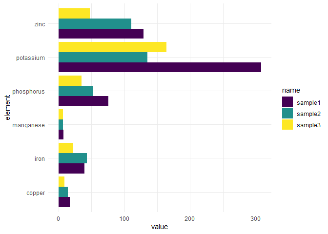

## NPK Plot

* N = Nitrogen, healthy green foliage
* P = Phosphorus, strong roots and biomas; increases bloom and friut production
* K = Potassium, healthy plant growth; fights off diseases

### Mock Data 


``` r
elmts <- c("Nitrogen (N)","Phosphorus (P)","Potassium (K)")
dt <- data.frame(
  id = rep(paste0("sample",1:3), times=3), 
  element = rep(elmts, each=3), 
  value = c(85, 140, 125,          # N ref 100-130
            75.89, 52.47, 35.26,   # P ref 4-14
            307.91, 135.09, 164.1), # K ref 100-160
  low=NA, high=NA
)

# Define Optimum values for reference 
ref <- data.frame(
  id = "optimum", element = elmts, 
  value=c(120, 8, 130), low=c(110, 4, 100), high=c(130,14,160)
)
```


``` r
p <- rbind(dt, ref) %>% 
  ggplot(aes(x=element, y=value, fill=id, label=value)) +  
  geom_bar(stat="identity", position=position_dodge()) +
  #geom_text(position=position_dodge()) + # add numbers to top of the bar
  geom_errorbar(aes(ymin=low, ymax=high), width=.2, position=position_dodge(.9)) + 
  scale_fill_paletteer_d("ggthemes::excel_Crop") + 
  labs(title="NPK Macronutrients", x="Macronutirent", y="Test Value", fill="" ) + 
  theme_minimal() #+ coord_flip()

# Make graphics interactive 
ggplotly(p)
```

```{=html}
<div class="plotly html-widget html-fill-item" id="htmlwidget-909d9f9e0e0afe5e7c2f" style="width:672px;height:480px;"></div>
<script type="application/json" data-for="htmlwidget-909d9f9e0e0afe5e7c2f">{"x":{"data":[{"orientation":"v","width":[0.22500000000000009,0.22500000000000009,0.22500000000000053],"base":[0,0,0],"x":[0.66250000000000009,1.6625000000000001,2.6625000000000001],"y":[120,8,130],"text":["element: Nitrogen (N)<br />value: 120.00<br />id: optimum<br />value: 120.00","element: Phosphorus (P)<br />value:   8.00<br />id: optimum<br />value:   8.00","element: Potassium (K)<br />value: 130.00<br />id: optimum<br />value: 130.00"],"type":"bar","textposition":"none","marker":{"autocolorscale":false,"color":"rgba(140,141,134,1)","line":{"width":1.8897637795275593,"color":"transparent"}},"name":"optimum","legendgroup":"optimum","showlegend":true,"xaxis":"x","yaxis":"y","hoverinfo":"text","frame":null},{"orientation":"v","width":[0.22500000000000009,0.22500000000000009,0.22499999999999964],"base":[0,0,0],"x":[0.88749999999999996,1.8875,2.8875000000000002],"y":[85,75.890000000000001,307.91000000000003],"text":["element: Nitrogen (N)<br />value:  85.00<br />id: sample1<br />value:  85.00","element: Phosphorus (P)<br />value:  75.89<br />id: sample1<br />value:  75.89","element: Potassium (K)<br />value: 307.91<br />id: sample1<br />value: 307.91"],"type":"bar","textposition":"none","marker":{"autocolorscale":false,"color":"rgba(230,192,105,1)","line":{"width":1.8897637795275593,"color":"transparent"}},"name":"sample1","legendgroup":"sample1","showlegend":true,"xaxis":"x","yaxis":"y","hoverinfo":"text","frame":null},{"orientation":"v","width":[0.22500000000000009,0.22499999999999987,0.22499999999999964],"base":[0,0,0],"x":[1.1125,2.1124999999999998,3.1124999999999998],"y":[140,52.469999999999999,135.09],"text":["element: Nitrogen (N)<br />value: 140.00<br />id: sample2<br />value: 140.00","element: Phosphorus (P)<br />value:  52.47<br />id: sample2<br />value:  52.47","element: Potassium (K)<br />value: 135.09<br />id: sample2<br />value: 135.09"],"type":"bar","textposition":"none","marker":{"autocolorscale":false,"color":"rgba(137,123,97,1)","line":{"width":1.8897637795275593,"color":"transparent"}},"name":"sample2","legendgroup":"sample2","showlegend":true,"xaxis":"x","yaxis":"y","hoverinfo":"text","frame":null},{"orientation":"v","width":[0.22500000000000009,0.22499999999999964,0.22500000000000053],"base":[0,0,0],"x":[1.3374999999999999,2.3374999999999999,3.3374999999999999],"y":[125,35.259999999999998,164.09999999999999],"text":["element: Nitrogen (N)<br />value: 125.00<br />id: sample3<br />value: 125.00","element: Phosphorus (P)<br />value:  35.26<br />id: sample3<br />value:  35.26","element: Potassium (K)<br />value: 164.10<br />id: sample3<br />value: 164.10"],"type":"bar","textposition":"none","marker":{"autocolorscale":false,"color":"rgba(141,171,142,1)","line":{"width":1.8897637795275593,"color":"transparent"}},"name":"sample3","legendgroup":"sample3","showlegend":true,"xaxis":"x","yaxis":"y","hoverinfo":"text","frame":null},{"x":[0.66249999999999998,1.6625000000000001,2.6625000000000001],"y":[120,8,130],"text":["element: Nitrogen (N)<br />value: 120.00<br />id: optimum<br />value: 120.00<br />low: 110<br />high: 130","element: Phosphorus (P)<br />value:   8.00<br />id: optimum<br />value:   8.00<br />low:   4<br />high:  14","element: Potassium (K)<br />value: 130.00<br />id: optimum<br />value: 130.00<br />low: 100<br />high: 160"],"type":"scatter","mode":"lines","opacity":1,"line":{"color":"transparent"},"error_y":{"array":[10,6,30],"arrayminus":[10,4,30],"type":"data","width":3.500000000000004,"symmetric":false,"color":"rgba(0,0,0,1)"},"name":"optimum","legendgroup":"optimum","showlegend":false,"xaxis":"x","yaxis":"y","hoverinfo":"text","frame":null},{"x":[0.88749999999999996,1.8875,2.8875000000000002],"y":[85,75.890000000000001,307.91000000000003],"text":["element: Nitrogen (N)<br />value:  85.00<br />id: sample1<br />value:  85.00<br />low:  NA<br />high:  NA","element: Phosphorus (P)<br />value:  75.89<br />id: sample1<br />value:  75.89<br />low:  NA<br />high:  NA","element: Potassium (K)<br />value: 307.91<br />id: sample1<br />value: 307.91<br />low:  NA<br />high:  NA"],"type":"scatter","mode":"lines","opacity":1,"line":{"color":"transparent"},"error_y":{"array":[null,null,null],"arrayminus":[null,null,null],"type":"data","width":3.500000000000004,"symmetric":false,"color":"rgba(0,0,0,1)"},"name":"sample1","legendgroup":"sample1","showlegend":false,"xaxis":"x","yaxis":"y","hoverinfo":"text","frame":null},{"x":[1.1125,2.1124999999999998,3.1124999999999998],"y":[140,52.469999999999999,135.09],"text":["element: Nitrogen (N)<br />value: 140.00<br />id: sample2<br />value: 140.00<br />low:  NA<br />high:  NA","element: Phosphorus (P)<br />value:  52.47<br />id: sample2<br />value:  52.47<br />low:  NA<br />high:  NA","element: Potassium (K)<br />value: 135.09<br />id: sample2<br />value: 135.09<br />low:  NA<br />high:  NA"],"type":"scatter","mode":"lines","opacity":1,"line":{"color":"transparent"},"error_y":{"array":[null,null,null],"arrayminus":[null,null,null],"type":"data","width":3.4999999999999871,"symmetric":false,"color":"rgba(0,0,0,1)"},"name":"sample2","legendgroup":"sample2","showlegend":false,"xaxis":"x","yaxis":"y","hoverinfo":"text","frame":null},{"x":[1.3374999999999999,2.3374999999999999,3.3374999999999999],"y":[125,35.259999999999998,164.09999999999999],"text":["element: Nitrogen (N)<br />value: 125.00<br />id: sample3<br />value: 125.00<br />low:  NA<br />high:  NA","element: Phosphorus (P)<br />value:  35.26<br />id: sample3<br />value:  35.26<br />low:  NA<br />high:  NA","element: Potassium (K)<br />value: 164.10<br />id: sample3<br />value: 164.10<br />low:  NA<br />high:  NA"],"type":"scatter","mode":"lines","opacity":1,"line":{"color":"transparent"},"error_y":{"array":[null,null,null],"arrayminus":[null,null,null],"type":"data","width":3.4999999999999871,"symmetric":false,"color":"rgba(0,0,0,1)"},"name":"sample3","legendgroup":"sample3","showlegend":false,"xaxis":"x","yaxis":"y","hoverinfo":"text","frame":null}],"layout":{"margin":{"t":43.762557077625573,"r":7.3059360730593621,"b":40.182648401826491,"l":43.105022831050235},"font":{"color":"rgba(0,0,0,1)","family":"","size":14.611872146118724},"title":{"text":"NPK Macronutrients","font":{"color":"rgba(0,0,0,1)","family":"","size":17.534246575342465},"x":0,"xref":"paper"},"xaxis":{"domain":[0,1],"automargin":true,"type":"linear","autorange":false,"range":[0.40000000000000002,3.6000000000000001],"tickmode":"array","ticktext":["Nitrogen (N)","Phosphorus (P)","Potassium (K)"],"tickvals":[1,2,3],"categoryorder":"array","categoryarray":["Nitrogen (N)","Phosphorus (P)","Potassium (K)"],"nticks":null,"ticks":"","tickcolor":null,"ticklen":3.6529680365296811,"tickwidth":0,"showticklabels":true,"tickfont":{"color":"rgba(77,77,77,1)","family":"","size":11.68949771689498},"tickangle":-0,"showline":false,"linecolor":null,"linewidth":0,"showgrid":true,"gridcolor":"rgba(235,235,235,1)","gridwidth":0.66417600664176002,"zeroline":false,"anchor":"y","title":{"text":"Macronutirent","font":{"color":"rgba(0,0,0,1)","family":"","size":14.611872146118724}},"hoverformat":".2f"},"yaxis":{"domain":[0,1],"automargin":true,"type":"linear","autorange":false,"range":[-15.395500000000002,323.30550000000005],"tickmode":"array","ticktext":["0","100","200","300"],"tickvals":[0,100,200,300],"categoryorder":"array","categoryarray":["0","100","200","300"],"nticks":null,"ticks":"","tickcolor":null,"ticklen":3.6529680365296811,"tickwidth":0,"showticklabels":true,"tickfont":{"color":"rgba(77,77,77,1)","family":"","size":11.68949771689498},"tickangle":-0,"showline":false,"linecolor":null,"linewidth":0,"showgrid":true,"gridcolor":"rgba(235,235,235,1)","gridwidth":0.66417600664176002,"zeroline":false,"anchor":"x","title":{"text":"Test Value","font":{"color":"rgba(0,0,0,1)","family":"","size":14.611872146118724}},"hoverformat":".2f"},"shapes":[{"type":"rect","fillcolor":null,"line":{"color":null,"width":0,"linetype":[]},"yref":"paper","xref":"paper","x0":0,"x1":1,"y0":0,"y1":1}],"showlegend":true,"legend":{"bgcolor":null,"bordercolor":null,"borderwidth":0,"font":{"color":"rgba(0,0,0,1)","family":"","size":11.68949771689498},"title":{"text":"","font":{"color":"rgba(0,0,0,1)","family":"","size":14.611872146118724}}},"hovermode":"closest","barmode":"relative"},"config":{"doubleClick":"reset","modeBarButtonsToAdd":["hoverclosest","hovercompare"],"showSendToCloud":false},"source":"A","attrs":{"36087028261e":{"x":{},"y":{},"fill":{},"label":{},"type":"bar"},"360838261382":{"x":{},"y":{},"fill":{},"label":{},"ymin":{},"ymax":{}}},"cur_data":"36087028261e","visdat":{"36087028261e":["function (y) ","x"],"360838261382":["function (y) ","x"]},"highlight":{"on":"plotly_click","persistent":false,"dynamic":false,"selectize":false,"opacityDim":0.20000000000000001,"selected":{"opacity":1},"debounce":0},"shinyEvents":["plotly_hover","plotly_click","plotly_selected","plotly_relayout","plotly_brushed","plotly_brushing","plotly_clickannotation","plotly_doubleclick","plotly_deselect","plotly_afterplot","plotly_sunburstclick"],"base_url":"https://plot.ly"},"evals":[],"jsHooks":[]}</script>
```

## pH Plot


``` r
# Acidic <3.5 - 6.5
# Optimal 5.5-7.0
# Alkaline 7.4->9.0

plot_ly(
  type = "indicator", mode = "gauge+number+delta", #
  title = list(text = "Soil pH", font = list(size = 24)),
  value = 6.4,
  delta = list(reference = 7, increasing = list(color = "deeppink"), decreasing = list(color = "deeppink")),
  gauge = list(
    axis = list(range = list(NULL, 14), tickwidth = 0.2, tickcolor = "darkgray"),
    bar = list(color = "darkgray", size = 0.2),bgcolor = "white", borderwidth = 2, bordercolor = "gray",
    threshold = list(line = list(color = "deeppink", width = 7), thickness = 1, value = 7),
    steps = list(
      list(range = c(0,1), color="tomato"),
      list(range = c(1,2), color="coral"),
      list(range = c(2,3), color="orange"),
      list(range = c(3,4), color="gold"),
      list(range = c(4,5), color="yellow"),
      list(range = c(5,6), color="greenyellow"),
      list(range = c(6,7), color="limegreen"),
      list(range = c(7,8), color="forestgreen"), #"seagreen3"),
      list(range = c(8,9), color="darkcyan"), 
      list(range = c(9,10),color="steelblue"),       
      list(range = c(10,11),color="royalblue"),
      list(range = c(11,12),color="slateblue"),
      list(range = c(12,13),color="RebeccaPurple"),
      list(range = c(13,14),color="indigo")))) %>%
  layout(margin = list(l=20,r=30), font = list(color = "darkblue", family = "Arial"))
```

```{=html}
<div class="plotly html-widget html-fill-item" id="htmlwidget-e6564f864e82e36f8f29" style="width:672px;height:480px;"></div>
<script type="application/json" data-for="htmlwidget-e6564f864e82e36f8f29">{"x":{"visdat":{"360879527169":["function () ","plotlyVisDat"]},"cur_data":"360879527169","attrs":{"360879527169":{"mode":"gauge+number+delta","title":{"text":"Soil pH","font":{"size":24}},"value":6.4000000000000004,"delta":{"reference":7,"increasing":{"color":"deeppink"},"decreasing":{"color":"deeppink"}},"gauge":{"axis":{"range":[null,14],"tickwidth":0.20000000000000001,"tickcolor":"darkgray"},"bar":{"color":"darkgray","size":0.20000000000000001},"bgcolor":"white","borderwidth":2,"bordercolor":"gray","threshold":{"line":{"color":"deeppink","width":7},"thickness":1,"value":7},"steps":[{"range":[0,1],"color":"tomato"},{"range":[1,2],"color":"coral"},{"range":[2,3],"color":"orange"},{"range":[3,4],"color":"gold"},{"range":[4,5],"color":"yellow"},{"range":[5,6],"color":"greenyellow"},{"range":[6,7],"color":"limegreen"},{"range":[7,8],"color":"forestgreen"},{"range":[8,9],"color":"darkcyan"},{"range":[9,10],"color":"steelblue"},{"range":[10,11],"color":"royalblue"},{"range":[11,12],"color":"slateblue"},{"range":[12,13],"color":"RebeccaPurple"},{"range":[13,14],"color":"indigo"}]},"alpha_stroke":1,"sizes":[10,100],"spans":[1,20],"type":"indicator"}},"layout":{"margin":{"b":40,"l":20,"t":25,"r":30},"font":{"color":"darkblue","family":"Arial"},"hovermode":"closest","showlegend":false},"source":"A","config":{"modeBarButtonsToAdd":["hoverclosest","hovercompare"],"showSendToCloud":false},"data":[{"mode":"gauge+number+delta","title":{"text":"Soil pH","font":{"size":24}},"value":6.4000000000000004,"delta":{"reference":7,"increasing":{"color":"deeppink"},"decreasing":{"color":"deeppink"}},"gauge":{"axis":{"range":[[],14],"tickwidth":0.20000000000000001,"tickcolor":"darkgray"},"bar":{"color":"darkgray","size":0.20000000000000001},"bgcolor":"white","borderwidth":2,"bordercolor":"gray","threshold":{"line":{"color":"deeppink","width":7},"thickness":1,"value":7},"steps":[{"range":[0,1],"color":"tomato"},{"range":[1,2],"color":"coral"},{"range":[2,3],"color":"orange"},{"range":[3,4],"color":"gold"},{"range":[4,5],"color":"yellow"},{"range":[5,6],"color":"greenyellow"},{"range":[6,7],"color":"limegreen"},{"range":[7,8],"color":"forestgreen"},{"range":[8,9],"color":"darkcyan"},{"range":[9,10],"color":"steelblue"},{"range":[10,11],"color":"royalblue"},{"range":[11,12],"color":"slateblue"},{"range":[12,13],"color":"RebeccaPurple"},{"range":[13,14],"color":"indigo"}]},"type":"indicator","frame":null}],"highlight":{"on":"plotly_click","persistent":false,"dynamic":false,"selectize":false,"opacityDim":0.20000000000000001,"selected":{"opacity":1},"debounce":0},"shinyEvents":["plotly_hover","plotly_click","plotly_selected","plotly_relayout","plotly_brushed","plotly_brushing","plotly_clickannotation","plotly_doubleclick","plotly_deselect","plotly_afterplot","plotly_sunburstclick"],"base_url":"https://plot.ly"},"evals":[],"jsHooks":[]}</script>
```

## Load Example Test Result


``` r
dt <- read.csv("data_example.csv", skip=6, stringsAsFactors = FALSE)[c(1:7),c(3,4,6,8,10)] 
colnames(dt) <- c("type","element", paste0("sample",1:3))
dt2 <- dt %>% pivot_longer(cols = starts_with("sample")) %>% transform(value = as.numeric(value))
```

### Plot data


``` r
dt2 %>% filter(type == "nutrient") %>% 
  ggplot(aes(x=element, y=value, fill=name)) +  
  geom_bar(stat="identity", position=position_dodge()) +
  scale_fill_viridis(discrete = TRUE) +
  theme_minimal()  + coord_flip()
```

<!-- -->

## Session Information (for Reproducibility)


``` r
print(sessionInfo(), locale = FALSE)
```

```
## R version 4.4.1 (2024-06-14 ucrt)
## Platform: x86_64-w64-mingw32/x64
## Running under: Windows 11 x64 (build 22621)
## 
## Matrix products: default
## 
## 
## attached base packages:
## [1] stats     graphics  grDevices utils     datasets  methods   base     
## 
## other attached packages:
## [1] plotly_4.10.4     viridis_0.6.5     viridisLite_0.4.2 paletteer_1.6.0  
## [5] ggplot2_3.5.1     tidyr_1.3.1       dplyr_1.1.4      
## 
## loaded via a namespace (and not attached):
##  [1] gtable_0.3.5      jsonlite_1.8.8    highr_0.11        compiler_4.4.1   
##  [5] rematch2_2.1.2    tidyselect_1.2.1  gridExtra_2.3     jquerylib_0.1.4  
##  [9] scales_1.3.0      yaml_2.3.10       fastmap_1.2.0     R6_2.5.1         
## [13] labeling_0.4.3    generics_0.1.3    knitr_1.48        htmlwidgets_1.6.4
## [17] tibble_3.2.1      munsell_0.5.1     bslib_0.8.0       pillar_1.9.0     
## [21] rlang_1.1.4       utf8_1.2.4        cachem_1.1.0      xfun_0.47        
## [25] prismatic_1.1.2   sass_0.4.9        lazyeval_0.2.2    cli_3.6.3        
## [29] withr_3.0.1       magrittr_2.0.3    crosstalk_1.2.1   digest_0.6.37    
## [33] grid_4.4.1        rstudioapi_0.16.0 lifecycle_1.0.4   vctrs_0.6.5      
## [37] data.table_1.16.0 evaluate_0.24.0   glue_1.7.0        farver_2.1.2     
## [41] fansi_1.0.6       colorspace_2.1-1  httr_1.4.7        rmarkdown_2.28   
## [45] purrr_1.0.2       tools_4.4.1       pkgconfig_2.0.3   htmltools_0.5.8.1
```
