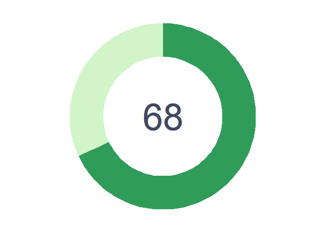
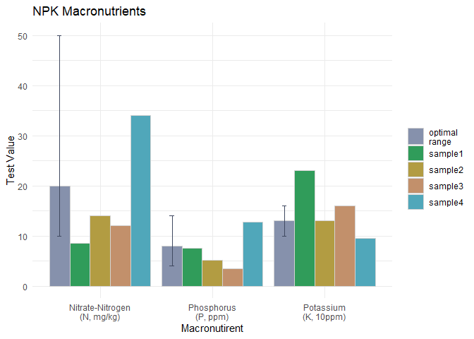
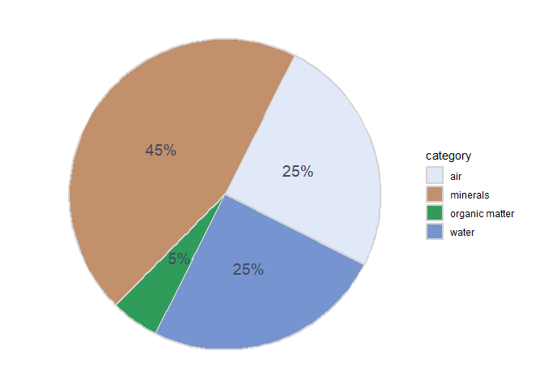
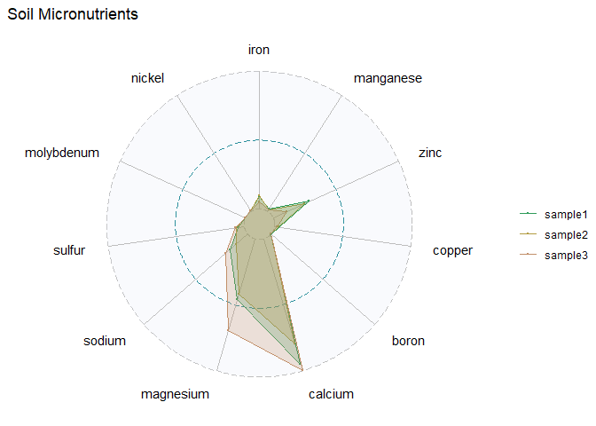

## Overall Soil Health


``` r
hval<- 68 # overall soil health value

df <- data.frame(hsize=4, ymin = c(0,hval), ymax = c(hval, 100), group=c("health", "other"))

df %>% ggplot(aes(xmax = 4, xmin=2.2, ymin=ymin, ymax=ymax, fill=group)) +
  geom_rect() + coord_polar(theta="y") + xlim(c(-1, 4)) +
  geom_text(x=-1, y=0, label=hval, size=20, col=slate700) +
  scale_fill_manual(values=c(green400,green10)) +
  theme_void() + theme(legend.position = "none")
```

<!-- -->

## NPK Plot

* N = Nitrogen, healthy green foliage
* P = Phosphorus, strong roots and biomas; increases bloom and friut production
* K = Potassium, healthy plant growth; fights off diseases

### Mock Data 


``` r
elmts <- c("Nitrate-Nitrogen\n(N, mg/kg)","Phosphorus\n(P, ppm)","Potassium\n(K, 10ppm)")
NPKdt <- data.frame(
  id = rep(paste0("sample",1:4), times=3), 
  element = rep(elmts, each=4), 
  value = c(8.5, 14, 12, 34,          # N ref 10-50 mg/kg
            7.5, 5.2, 3.5, 12.7,   # P ref 4-14 ppm
            23, 13, 16, 9.5), # K ref 10-16 10ppm
  low=NA, high=NA
)

# Define Optimum values for reference 
NPKref <- data.frame(
  id = "optimal\nrange", element = elmts, 
  value=c(20, 8, 13), low=c(10, 4, 10), high=c(50,14,16)
)
```


``` r
rbind(NPKdt, NPKref) %>% 
  ggplot(aes(x=element, y=value, fill=id, label=value)) +  
  geom_bar(stat="identity", position=position_dodge(), color="lightgray") +
  #geom_text(position=position_dodge()) + # add numbers to top of the bar
  geom_errorbar(aes(ymin=low, ymax=high), width=.2, position=position_dodge(.9), color=slate700) + 
  scale_fill_manual(values=c(slate400, green400, citrine400, fur400, ocean400))+ # scale_fill_paletteer_d("ggthemes::excel_Crop") + 
  labs(title="NPK Macronutrients", x="Macronutirent", y="Test Value", fill="" ) + 
  theme_minimal()
```

<!-- -->

``` r
# Make graphics interactive 
#ggplotly(p)
```

## pH Plot


``` r
ph_val <- 6.4
ph_ref <- c(5.5, 7.0)

plot_ly(
  type = "indicator", mode = "gauge+number+delta", #
  #title = list(text = "Soil pH", font = list(size = 24)),
  value = ph_val,
  delta = list(reference = 7, increasing = list(color = cobalt400), decreasing = list(color = salmon400)),
  gauge = list(
    axis = list(range = list(0, 14), tickwidth = 0.2, tickcolor = "lightgray"),
    bar = list(color = "lightgray", thickness = 0),bgcolor = "white", borderwidth = 1.2, bordercolor = "lightgray",
    threshold = list(line = list(color = slate700, width = 7), thickness = 1, value = ph_val),
    steps = list(
      list(range = c(0,1), color="tomato"),
      list(range = c(1,2), color="coral"),
      list(range = c(2,3), color="orange"),
      list(range = c(3,4), color="gold"),
      list(range = c(4,5), color="yellow"),
      list(range = c(5,6), color="greenyellow"),
      list(range = c(6,7), color="limegreen"),
      list(range = c(7,8), color=green400), #"forestgreen", "seagreen3"),
      list(range = c(8,9), color="darkcyan"), 
      list(range = c(9,10),color="steelblue"), #       
      list(range = c(10,11),color="royalblue"),
      list(range = c(11,12),color="slateblue"),
      list(range = c(12,13),color="RebeccaPurple"),
      list(range = c(13,14),color="indigo")))) %>%
  layout(margin = list(l=20,r=30), font = list(color = slate700, family = "Arial"))
```

```{=html}
<div class="plotly html-widget html-fill-item" id="htmlwidget-3690296b24814e999edb" style="width:672px;height:480px;"></div>
<script type="application/json" data-for="htmlwidget-3690296b24814e999edb">{"x":{"visdat":{"308813e42481":["function () ","plotlyVisDat"]},"cur_data":"308813e42481","attrs":{"308813e42481":{"mode":"gauge+number+delta","value":6.4000000000000004,"delta":{"reference":7,"increasing":{"color":"#7694CF"},"decreasing":{"color":"#DE7878"}},"gauge":{"axis":{"range":[0,14],"tickwidth":0.20000000000000001,"tickcolor":"lightgray"},"bar":{"color":"lightgray","thickness":0},"bgcolor":"white","borderwidth":1.2,"bordercolor":"lightgray","threshold":{"line":{"color":"#404961","width":7},"thickness":1,"value":6.4000000000000004},"steps":[{"range":[0,1],"color":"tomato"},{"range":[1,2],"color":"coral"},{"range":[2,3],"color":"orange"},{"range":[3,4],"color":"gold"},{"range":[4,5],"color":"yellow"},{"range":[5,6],"color":"greenyellow"},{"range":[6,7],"color":"limegreen"},{"range":[7,8],"color":"#309C5A"},{"range":[8,9],"color":"darkcyan"},{"range":[9,10],"color":"steelblue"},{"range":[10,11],"color":"royalblue"},{"range":[11,12],"color":"slateblue"},{"range":[12,13],"color":"RebeccaPurple"},{"range":[13,14],"color":"indigo"}]},"alpha_stroke":1,"sizes":[10,100],"spans":[1,20],"type":"indicator"}},"layout":{"margin":{"b":40,"l":20,"t":25,"r":30},"font":{"color":"#404961","family":"Arial"},"hovermode":"closest","showlegend":false},"source":"A","config":{"modeBarButtonsToAdd":["hoverclosest","hovercompare"],"showSendToCloud":false},"data":[{"mode":"gauge+number+delta","value":6.4000000000000004,"delta":{"reference":7,"increasing":{"color":"#7694CF"},"decreasing":{"color":"#DE7878"}},"gauge":{"axis":{"range":[0,14],"tickwidth":0.20000000000000001,"tickcolor":"lightgray"},"bar":{"color":"lightgray","thickness":0},"bgcolor":"white","borderwidth":1.2,"bordercolor":"lightgray","threshold":{"line":{"color":"#404961","width":7},"thickness":1,"value":6.4000000000000004},"steps":[{"range":[0,1],"color":"tomato"},{"range":[1,2],"color":"coral"},{"range":[2,3],"color":"orange"},{"range":[3,4],"color":"gold"},{"range":[4,5],"color":"yellow"},{"range":[5,6],"color":"greenyellow"},{"range":[6,7],"color":"limegreen"},{"range":[7,8],"color":"#309C5A"},{"range":[8,9],"color":"darkcyan"},{"range":[9,10],"color":"steelblue"},{"range":[10,11],"color":"royalblue"},{"range":[11,12],"color":"slateblue"},{"range":[12,13],"color":"RebeccaPurple"},{"range":[13,14],"color":"indigo"}]},"type":"indicator","frame":null}],"highlight":{"on":"plotly_click","persistent":false,"dynamic":false,"selectize":false,"opacityDim":0.20000000000000001,"selected":{"opacity":1},"debounce":0},"shinyEvents":["plotly_hover","plotly_click","plotly_selected","plotly_relayout","plotly_brushed","plotly_brushing","plotly_clickannotation","plotly_doubleclick","plotly_deselect","plotly_afterplot","plotly_sunburstclick"],"base_url":"https://plot.ly"},"evals":[],"jsHooks":[]}</script>
```

<!-- https://stackoverflow.com/questions/24900903/how-to-draw-gauge-chart-in-r


``` r
gg.gauge <- function(pos,breaks=c(0,5.5,8,14)) {
  
  get.poly <- function(a,b,r1=0.5,r2=1.0) {
    th.start <- pi*(1-a/100)
    th.end   <- pi*(1-b/100)
    th       <- seq(th.start,th.end,length=14)
    x        <- c(r1*cos(th),rev(r2*cos(th)))
    y        <- c(r1*sin(th),rev(r2*sin(th)))
    return(data.frame(x,y))
  }
  
ggplot()+ 
    geom_polygon(data=get.poly(breaks[1],breaks[2]),aes(x,y),fill=cider400)+
    geom_polygon(data=get.poly(breaks[2],breaks[3]),aes(x,y),fill=green400)+
    geom_polygon(data=get.poly(breaks[3],breaks[4]),aes(x,y),fill=cobalt400)+
    geom_polygon(data=get.poly(pos-1,pos+1,0.2),aes(x,y))+
    geom_text(data=as.data.frame(breaks), size=5, fontface="bold", vjust=0,
              aes(x=1.1*cos(pi*(1-breaks/100)),y=1.1*sin(pi*(1-breaks/100)),label=breaks))+
    annotate("text",x=0,y=0,label=pos,vjust=0,size=8,fontface="bold")+
    coord_fixed() + theme_minimal()+
    theme(axis.text=element_blank(), axis.title=element_blank(), axis.ticks=element_blank(), 
          panel.grid=element_blank(), panel.border=element_blank()) 
}
gg.gauge(52,breaks=c(0,5.5,8,14))
```
-->

## Soil composition


``` r
org_m <- 5
org_ref <- c(3,6)

#create data frame
dt <- data.frame("category" = c('minerals', 'water', 'air', 'organic matter'),
                   "amount" = c(50-org_m, 25, 25, org_m), 
                   "color"=c(fur400, cobalt400, slate400, green400))

ggplot(dt, aes(x="", y=amount, fill=category)) +
  geom_bar(stat="identity", width=1, color="lightgray", size=1) +
  coord_polar("y", start=90) +
  scale_fill_manual(values=c(slate100, fur400, green400, cobalt400)) + 
  geom_text(aes(label = paste0(amount, "%")), position = position_stack(vjust=0.5), color=slate700, size=5) +
  theme_void()
```

```
## Warning: Using `size` aesthetic for lines was deprecated in ggplot2 3.4.0.
## ℹ Please use `linewidth` instead.
## This warning is displayed once every 8 hours.
## Call `lifecycle::last_lifecycle_warnings()` to see where this warning was
## generated.
```

<!-- -->
## Micronutrients


``` r
# "sulfur (S)", "calcium (Ca)", "magnesium (Mg)", "iron (Fe)", "boron (B)", "manganese (Mn)", "copper (Cu)", "zinc (Zn)", "molybdenum (Mo)", "nickel (Ni)", "chlorine (Cl)"

# Source code from https://github.com/ricardo-bion/ggradar
library(ggradar)
library(scales)
```

```
## 
## Attaching package: 'scales'
```

```
## The following object is masked from 'package:viridis':
## 
##     viridis_pal
```

``` r
# Example data 
dt <- read.csv("data_example.csv", skip=6, stringsAsFactors = FALSE)[c(4:14),c(4,6,8,10)] 
colnames(dt) <- c("element", paste0("sample",1:3))
dt2 <- dt %>% 
  pivot_longer(cols = starts_with("sample")) %>% transform(value = as.numeric(value))  %>% pivot_wider(names_from = element)

# Plot radar
ggradar(dt2, values.radar="", axis.label.size = 4, plot.title = "Soil Micronutrients",
        group.point.size = 0, group.line.width = 0.7, 
        fill=TRUE, fill.alpha = 0.25, group.colours = c(green400,citrine400,fur400), 
        background.circle.colour = slate100, background.circle.transparency = 0.2) + 
  theme_void()
```

```
## Warning: 'plot.data' contains value(s) > grid.max, data scaled to grid.max
```

```
## Warning: Removed 1 row containing missing values or values outside the scale range
## (`geom_text()`).
## Removed 1 row containing missing values or values outside the scale range
## (`geom_text()`).
```

<!-- -->

## Table View


``` r
npk_dt <- NPKdt %>% pivot_wider(names_from = id) %>% select(-c(low,high)) %>% 
  left_join(NPKref %>% select(-c(id,value)),by="element")
npk_dt$group <- "Macronutrients"
ph_dt <- data.frame(element = "pH value", t(runif(5.5,7, n=4)), t(ph_ref), "Acidity")
org_dt <- data.frame(element = "Organic matter (%)", t(runif(2,7, n=4)), t(org_ref), "Soil composition")
colnames(ph_dt)[-1] <- colnames(org_dt)[-1] <- c(paste0("sample",1:4), "low", "high", "group")

rbind(npk_dt, org_dt, ph_dt) %>% 
  gt(groupname_col = "group") %>% fmt_number(decimals = 2, drop_trailing_zeros=TRUE) %>% 
  tab_spanner(label = "Optimal range", columns = c(low, high)) %>% 
  tab_style(style=cell_borders(sides="left"), locations = cells_body(columns=c(sample1, low)))
```

```{=html}
<div id="tunmfmzmyh" style="padding-left:0px;padding-right:0px;padding-top:10px;padding-bottom:10px;overflow-x:auto;overflow-y:auto;width:auto;height:auto;">
<style>#tunmfmzmyh table {
  font-family: system-ui, 'Segoe UI', Roboto, Helvetica, Arial, sans-serif, 'Apple Color Emoji', 'Segoe UI Emoji', 'Segoe UI Symbol', 'Noto Color Emoji';
  -webkit-font-smoothing: antialiased;
  -moz-osx-font-smoothing: grayscale;
}

#tunmfmzmyh thead, #tunmfmzmyh tbody, #tunmfmzmyh tfoot, #tunmfmzmyh tr, #tunmfmzmyh td, #tunmfmzmyh th {
  border-style: none;
}

#tunmfmzmyh p {
  margin: 0;
  padding: 0;
}

#tunmfmzmyh .gt_table {
  display: table;
  border-collapse: collapse;
  line-height: normal;
  margin-left: auto;
  margin-right: auto;
  color: #333333;
  font-size: 16px;
  font-weight: normal;
  font-style: normal;
  background-color: #FFFFFF;
  width: auto;
  border-top-style: solid;
  border-top-width: 2px;
  border-top-color: #A8A8A8;
  border-right-style: none;
  border-right-width: 2px;
  border-right-color: #D3D3D3;
  border-bottom-style: solid;
  border-bottom-width: 2px;
  border-bottom-color: #A8A8A8;
  border-left-style: none;
  border-left-width: 2px;
  border-left-color: #D3D3D3;
}

#tunmfmzmyh .gt_caption {
  padding-top: 4px;
  padding-bottom: 4px;
}

#tunmfmzmyh .gt_title {
  color: #333333;
  font-size: 125%;
  font-weight: initial;
  padding-top: 4px;
  padding-bottom: 4px;
  padding-left: 5px;
  padding-right: 5px;
  border-bottom-color: #FFFFFF;
  border-bottom-width: 0;
}

#tunmfmzmyh .gt_subtitle {
  color: #333333;
  font-size: 85%;
  font-weight: initial;
  padding-top: 3px;
  padding-bottom: 5px;
  padding-left: 5px;
  padding-right: 5px;
  border-top-color: #FFFFFF;
  border-top-width: 0;
}

#tunmfmzmyh .gt_heading {
  background-color: #FFFFFF;
  text-align: center;
  border-bottom-color: #FFFFFF;
  border-left-style: none;
  border-left-width: 1px;
  border-left-color: #D3D3D3;
  border-right-style: none;
  border-right-width: 1px;
  border-right-color: #D3D3D3;
}

#tunmfmzmyh .gt_bottom_border {
  border-bottom-style: solid;
  border-bottom-width: 2px;
  border-bottom-color: #D3D3D3;
}

#tunmfmzmyh .gt_col_headings {
  border-top-style: solid;
  border-top-width: 2px;
  border-top-color: #D3D3D3;
  border-bottom-style: solid;
  border-bottom-width: 2px;
  border-bottom-color: #D3D3D3;
  border-left-style: none;
  border-left-width: 1px;
  border-left-color: #D3D3D3;
  border-right-style: none;
  border-right-width: 1px;
  border-right-color: #D3D3D3;
}

#tunmfmzmyh .gt_col_heading {
  color: #333333;
  background-color: #FFFFFF;
  font-size: 100%;
  font-weight: normal;
  text-transform: inherit;
  border-left-style: none;
  border-left-width: 1px;
  border-left-color: #D3D3D3;
  border-right-style: none;
  border-right-width: 1px;
  border-right-color: #D3D3D3;
  vertical-align: bottom;
  padding-top: 5px;
  padding-bottom: 6px;
  padding-left: 5px;
  padding-right: 5px;
  overflow-x: hidden;
}

#tunmfmzmyh .gt_column_spanner_outer {
  color: #333333;
  background-color: #FFFFFF;
  font-size: 100%;
  font-weight: normal;
  text-transform: inherit;
  padding-top: 0;
  padding-bottom: 0;
  padding-left: 4px;
  padding-right: 4px;
}

#tunmfmzmyh .gt_column_spanner_outer:first-child {
  padding-left: 0;
}

#tunmfmzmyh .gt_column_spanner_outer:last-child {
  padding-right: 0;
}

#tunmfmzmyh .gt_column_spanner {
  border-bottom-style: solid;
  border-bottom-width: 2px;
  border-bottom-color: #D3D3D3;
  vertical-align: bottom;
  padding-top: 5px;
  padding-bottom: 5px;
  overflow-x: hidden;
  display: inline-block;
  width: 100%;
}

#tunmfmzmyh .gt_spanner_row {
  border-bottom-style: hidden;
}

#tunmfmzmyh .gt_group_heading {
  padding-top: 8px;
  padding-bottom: 8px;
  padding-left: 5px;
  padding-right: 5px;
  color: #333333;
  background-color: #FFFFFF;
  font-size: 100%;
  font-weight: initial;
  text-transform: inherit;
  border-top-style: solid;
  border-top-width: 2px;
  border-top-color: #D3D3D3;
  border-bottom-style: solid;
  border-bottom-width: 2px;
  border-bottom-color: #D3D3D3;
  border-left-style: none;
  border-left-width: 1px;
  border-left-color: #D3D3D3;
  border-right-style: none;
  border-right-width: 1px;
  border-right-color: #D3D3D3;
  vertical-align: middle;
  text-align: left;
}

#tunmfmzmyh .gt_empty_group_heading {
  padding: 0.5px;
  color: #333333;
  background-color: #FFFFFF;
  font-size: 100%;
  font-weight: initial;
  border-top-style: solid;
  border-top-width: 2px;
  border-top-color: #D3D3D3;
  border-bottom-style: solid;
  border-bottom-width: 2px;
  border-bottom-color: #D3D3D3;
  vertical-align: middle;
}

#tunmfmzmyh .gt_from_md > :first-child {
  margin-top: 0;
}

#tunmfmzmyh .gt_from_md > :last-child {
  margin-bottom: 0;
}

#tunmfmzmyh .gt_row {
  padding-top: 8px;
  padding-bottom: 8px;
  padding-left: 5px;
  padding-right: 5px;
  margin: 10px;
  border-top-style: solid;
  border-top-width: 1px;
  border-top-color: #D3D3D3;
  border-left-style: none;
  border-left-width: 1px;
  border-left-color: #D3D3D3;
  border-right-style: none;
  border-right-width: 1px;
  border-right-color: #D3D3D3;
  vertical-align: middle;
  overflow-x: hidden;
}

#tunmfmzmyh .gt_stub {
  color: #333333;
  background-color: #FFFFFF;
  font-size: 100%;
  font-weight: initial;
  text-transform: inherit;
  border-right-style: solid;
  border-right-width: 2px;
  border-right-color: #D3D3D3;
  padding-left: 5px;
  padding-right: 5px;
}

#tunmfmzmyh .gt_stub_row_group {
  color: #333333;
  background-color: #FFFFFF;
  font-size: 100%;
  font-weight: initial;
  text-transform: inherit;
  border-right-style: solid;
  border-right-width: 2px;
  border-right-color: #D3D3D3;
  padding-left: 5px;
  padding-right: 5px;
  vertical-align: top;
}

#tunmfmzmyh .gt_row_group_first td {
  border-top-width: 2px;
}

#tunmfmzmyh .gt_row_group_first th {
  border-top-width: 2px;
}

#tunmfmzmyh .gt_summary_row {
  color: #333333;
  background-color: #FFFFFF;
  text-transform: inherit;
  padding-top: 8px;
  padding-bottom: 8px;
  padding-left: 5px;
  padding-right: 5px;
}

#tunmfmzmyh .gt_first_summary_row {
  border-top-style: solid;
  border-top-color: #D3D3D3;
}

#tunmfmzmyh .gt_first_summary_row.thick {
  border-top-width: 2px;
}

#tunmfmzmyh .gt_last_summary_row {
  padding-top: 8px;
  padding-bottom: 8px;
  padding-left: 5px;
  padding-right: 5px;
  border-bottom-style: solid;
  border-bottom-width: 2px;
  border-bottom-color: #D3D3D3;
}

#tunmfmzmyh .gt_grand_summary_row {
  color: #333333;
  background-color: #FFFFFF;
  text-transform: inherit;
  padding-top: 8px;
  padding-bottom: 8px;
  padding-left: 5px;
  padding-right: 5px;
}

#tunmfmzmyh .gt_first_grand_summary_row {
  padding-top: 8px;
  padding-bottom: 8px;
  padding-left: 5px;
  padding-right: 5px;
  border-top-style: double;
  border-top-width: 6px;
  border-top-color: #D3D3D3;
}

#tunmfmzmyh .gt_last_grand_summary_row_top {
  padding-top: 8px;
  padding-bottom: 8px;
  padding-left: 5px;
  padding-right: 5px;
  border-bottom-style: double;
  border-bottom-width: 6px;
  border-bottom-color: #D3D3D3;
}

#tunmfmzmyh .gt_striped {
  background-color: rgba(128, 128, 128, 0.05);
}

#tunmfmzmyh .gt_table_body {
  border-top-style: solid;
  border-top-width: 2px;
  border-top-color: #D3D3D3;
  border-bottom-style: solid;
  border-bottom-width: 2px;
  border-bottom-color: #D3D3D3;
}

#tunmfmzmyh .gt_footnotes {
  color: #333333;
  background-color: #FFFFFF;
  border-bottom-style: none;
  border-bottom-width: 2px;
  border-bottom-color: #D3D3D3;
  border-left-style: none;
  border-left-width: 2px;
  border-left-color: #D3D3D3;
  border-right-style: none;
  border-right-width: 2px;
  border-right-color: #D3D3D3;
}

#tunmfmzmyh .gt_footnote {
  margin: 0px;
  font-size: 90%;
  padding-top: 4px;
  padding-bottom: 4px;
  padding-left: 5px;
  padding-right: 5px;
}

#tunmfmzmyh .gt_sourcenotes {
  color: #333333;
  background-color: #FFFFFF;
  border-bottom-style: none;
  border-bottom-width: 2px;
  border-bottom-color: #D3D3D3;
  border-left-style: none;
  border-left-width: 2px;
  border-left-color: #D3D3D3;
  border-right-style: none;
  border-right-width: 2px;
  border-right-color: #D3D3D3;
}

#tunmfmzmyh .gt_sourcenote {
  font-size: 90%;
  padding-top: 4px;
  padding-bottom: 4px;
  padding-left: 5px;
  padding-right: 5px;
}

#tunmfmzmyh .gt_left {
  text-align: left;
}

#tunmfmzmyh .gt_center {
  text-align: center;
}

#tunmfmzmyh .gt_right {
  text-align: right;
  font-variant-numeric: tabular-nums;
}

#tunmfmzmyh .gt_font_normal {
  font-weight: normal;
}

#tunmfmzmyh .gt_font_bold {
  font-weight: bold;
}

#tunmfmzmyh .gt_font_italic {
  font-style: italic;
}

#tunmfmzmyh .gt_super {
  font-size: 65%;
}

#tunmfmzmyh .gt_footnote_marks {
  font-size: 75%;
  vertical-align: 0.4em;
  position: initial;
}

#tunmfmzmyh .gt_asterisk {
  font-size: 100%;
  vertical-align: 0;
}

#tunmfmzmyh .gt_indent_1 {
  text-indent: 5px;
}

#tunmfmzmyh .gt_indent_2 {
  text-indent: 10px;
}

#tunmfmzmyh .gt_indent_3 {
  text-indent: 15px;
}

#tunmfmzmyh .gt_indent_4 {
  text-indent: 20px;
}

#tunmfmzmyh .gt_indent_5 {
  text-indent: 25px;
}

#tunmfmzmyh .katex-display {
  display: inline-flex !important;
  margin-bottom: 0.75em !important;
}

#tunmfmzmyh div.Reactable > div.rt-table > div.rt-thead > div.rt-tr.rt-tr-group-header > div.rt-th-group:after {
  height: 0px !important;
}
</style>
<table class="gt_table" data-quarto-disable-processing="false" data-quarto-bootstrap="false">
  <thead>
    <tr class="gt_col_headings gt_spanner_row">
      <th class="gt_col_heading gt_columns_bottom_border gt_left" rowspan="2" colspan="1" scope="col" id="element">element</th>
      <th class="gt_col_heading gt_columns_bottom_border gt_right" rowspan="2" colspan="1" scope="col" id="sample1">sample1</th>
      <th class="gt_col_heading gt_columns_bottom_border gt_right" rowspan="2" colspan="1" scope="col" id="sample2">sample2</th>
      <th class="gt_col_heading gt_columns_bottom_border gt_right" rowspan="2" colspan="1" scope="col" id="sample3">sample3</th>
      <th class="gt_col_heading gt_columns_bottom_border gt_right" rowspan="2" colspan="1" scope="col" id="sample4">sample4</th>
      <th class="gt_center gt_columns_top_border gt_column_spanner_outer" rowspan="1" colspan="2" scope="colgroup" id="Optimal range">
        <span class="gt_column_spanner">Optimal range</span>
      </th>
    </tr>
    <tr class="gt_col_headings">
      <th class="gt_col_heading gt_columns_bottom_border gt_right" rowspan="1" colspan="1" scope="col" id="low">low</th>
      <th class="gt_col_heading gt_columns_bottom_border gt_right" rowspan="1" colspan="1" scope="col" id="high">high</th>
    </tr>
  </thead>
  <tbody class="gt_table_body">
    <tr class="gt_group_heading_row">
      <th colspan="7" class="gt_group_heading" scope="colgroup" id="Macronutrients">Macronutrients</th>
    </tr>
    <tr class="gt_row_group_first"><td headers="Macronutrients  element" class="gt_row gt_left">Nitrate-Nitrogen
(N, mg/kg)</td>
<td headers="Macronutrients  sample1" class="gt_row gt_right" style="border-left-width: 1px; border-left-style: solid; border-left-color: #000000;">8.5</td>
<td headers="Macronutrients  sample2" class="gt_row gt_right">14</td>
<td headers="Macronutrients  sample3" class="gt_row gt_right">12</td>
<td headers="Macronutrients  sample4" class="gt_row gt_right">34</td>
<td headers="Macronutrients  low" class="gt_row gt_right" style="border-left-width: 1px; border-left-style: solid; border-left-color: #000000;">10</td>
<td headers="Macronutrients  high" class="gt_row gt_right">50</td></tr>
    <tr><td headers="Macronutrients  element" class="gt_row gt_left">Phosphorus
(P, ppm)</td>
<td headers="Macronutrients  sample1" class="gt_row gt_right" style="border-left-width: 1px; border-left-style: solid; border-left-color: #000000;">7.5</td>
<td headers="Macronutrients  sample2" class="gt_row gt_right">5.2</td>
<td headers="Macronutrients  sample3" class="gt_row gt_right">3.5</td>
<td headers="Macronutrients  sample4" class="gt_row gt_right">12.7</td>
<td headers="Macronutrients  low" class="gt_row gt_right" style="border-left-width: 1px; border-left-style: solid; border-left-color: #000000;">4</td>
<td headers="Macronutrients  high" class="gt_row gt_right">14</td></tr>
    <tr><td headers="Macronutrients  element" class="gt_row gt_left">Potassium
(K, 10ppm)</td>
<td headers="Macronutrients  sample1" class="gt_row gt_right" style="border-left-width: 1px; border-left-style: solid; border-left-color: #000000;">23</td>
<td headers="Macronutrients  sample2" class="gt_row gt_right">13</td>
<td headers="Macronutrients  sample3" class="gt_row gt_right">16</td>
<td headers="Macronutrients  sample4" class="gt_row gt_right">9.5</td>
<td headers="Macronutrients  low" class="gt_row gt_right" style="border-left-width: 1px; border-left-style: solid; border-left-color: #000000;">10</td>
<td headers="Macronutrients  high" class="gt_row gt_right">16</td></tr>
    <tr class="gt_group_heading_row">
      <th colspan="7" class="gt_group_heading" scope="colgroup" id="Soil composition">Soil composition</th>
    </tr>
    <tr class="gt_row_group_first"><td headers="Soil composition  element" class="gt_row gt_left">Organic matter (%)</td>
<td headers="Soil composition  sample1" class="gt_row gt_right" style="border-left-width: 1px; border-left-style: solid; border-left-color: #000000;">5.74</td>
<td headers="Soil composition  sample2" class="gt_row gt_right">3.83</td>
<td headers="Soil composition  sample3" class="gt_row gt_right">4.91</td>
<td headers="Soil composition  sample4" class="gt_row gt_right">4.21</td>
<td headers="Soil composition  low" class="gt_row gt_right" style="border-left-width: 1px; border-left-style: solid; border-left-color: #000000;">3</td>
<td headers="Soil composition  high" class="gt_row gt_right">6</td></tr>
    <tr class="gt_group_heading_row">
      <th colspan="7" class="gt_group_heading" scope="colgroup" id="Acidity">Acidity</th>
    </tr>
    <tr class="gt_row_group_first"><td headers="Acidity  element" class="gt_row gt_left">pH value</td>
<td headers="Acidity  sample1" class="gt_row gt_right" style="border-left-width: 1px; border-left-style: solid; border-left-color: #000000;">6.37</td>
<td headers="Acidity  sample2" class="gt_row gt_right">6.61</td>
<td headers="Acidity  sample3" class="gt_row gt_right">5.52</td>
<td headers="Acidity  sample4" class="gt_row gt_right">6.83</td>
<td headers="Acidity  low" class="gt_row gt_right" style="border-left-width: 1px; border-left-style: solid; border-left-color: #000000;">5.5</td>
<td headers="Acidity  high" class="gt_row gt_right">7</td></tr>
  </tbody>
  
  
</table>
</div>
```

<!--TODO: Soil Respiration - CO2-C in ppm	100	>200-->
## Session Information (for Reproducibility)


``` r
print(sessionInfo(), locale = FALSE)
```

```
## R version 4.4.1 (2024-06-14 ucrt)
## Platform: x86_64-w64-mingw32/x64
## Running under: Windows 11 x64 (build 22621)
## 
## Matrix products: default
## 
## 
## attached base packages:
## [1] stats     graphics  grDevices utils     datasets  methods   base     
## 
## other attached packages:
##  [1] scales_1.3.0      ggradar_0.2       gt_0.11.0         plotly_4.10.4    
##  [5] viridis_0.6.5     viridisLite_0.4.2 paletteer_1.6.0   ggplot2_3.5.1    
##  [9] tidyr_1.3.1       dplyr_1.1.4      
## 
## loaded via a namespace (and not attached):
##  [1] sass_0.4.9        utf8_1.2.4        generics_0.1.3    xml2_1.3.6       
##  [5] digest_0.6.37     magrittr_2.0.3    evaluate_1.0.1    grid_4.4.1       
##  [9] fastmap_1.2.0     jsonlite_1.8.8    rematch2_2.1.2    gridExtra_2.3    
## [13] httr_1.4.7        purrr_1.0.2       fansi_1.0.6       crosstalk_1.2.1  
## [17] lazyeval_0.2.2    jquerylib_0.1.4   cli_3.6.3         rlang_1.1.4      
## [21] crayon_1.5.3      munsell_0.5.1     withr_3.0.1       cachem_1.1.0     
## [25] yaml_2.3.10       tools_4.4.1       colorspace_2.1-1  forcats_1.0.0    
## [29] vctrs_0.6.5       R6_2.5.1          lifecycle_1.0.4   htmlwidgets_1.6.4
## [33] pkgconfig_2.0.3   pillar_1.9.0      bslib_0.8.0       gtable_0.3.5     
## [37] glue_1.7.0        data.table_1.16.0 xfun_0.47         tibble_3.2.1     
## [41] tidyselect_1.2.1  highr_0.11        rstudioapi_0.16.0 knitr_1.48       
## [45] farver_2.1.2      htmltools_0.5.8.1 rmarkdown_2.28    labeling_0.4.3   
## [49] compiler_4.4.1
```
