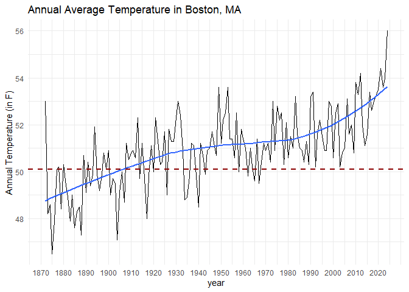
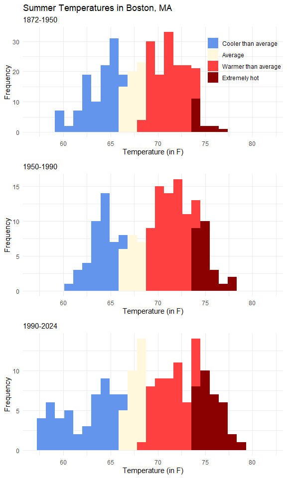

Temperature Shift in Boston
================
Juliane Manitz
11 October, 2024

## Load Data

NOWData - NOAA Online Weather Data. Monthly summarized data calculates
averages, totals, daily extremes or frequencies for the selected
variable for each month of the year for the selected range of years.
Note: trace precipition/snowfall/snow depth amounts are treated as zero
in sums, mean, and number of days counts. Annual average temperatures
are the average of the twelve monthly values. Temperatures are reported
in degrees F; precipitation, snowfall and snow depth are reported in
inches. Source: <https://www.weather.gov/wrh/Climate?wfo=box>

``` r
# To load all sheets in a workbook, use lapply()
path <- "Temp_Boston.xlsx"
dt_list <- map(excel_sheets(path), read_excel, path = path, skip=2)
names(dt_list) <- excel_sheets(path)
#dt_list <- lapply(excel_sheets(path), read_excel, path = path, skip=2)

# Data preprocessing
dt_list2 <- lapply(names(dt_list), function(x)
  dt_list[[x]] %>%  
    mutate_if(is.character, list(~na_if(., "M") %>% na_if(., "T") %>% as.numeric)) %>%
    pivot_longer(-Year, names_to = "Month", values_to = x) #  assign(x, df_list[[x]], envir = .GlobalEnv)
)

# Combine list into one dataset
dt <- Reduce(left_join, dt_list2)
```

    ## Joining with `by = join_by(Year, Month)`
    ## Joining with `by = join_by(Year, Month)`
    ## Joining with `by = join_by(Year, Month)`

``` r
# Separate Annual averages from monthly values
dtY <- dt %>% filter(Month == "Annual")
dtM <- dt %>% filter(Month != "Annual") %>% 
  mutate(date = paste0("01-",tolower(Month),"-",Year) %>% as.Date(format = "%d-%b-%Y"))
```

## Time Series

``` r
dtY %>% filter(Year<1950) %>% summarize(mean(meanTemp))
```

    ## # A tibble: 1 × 1
    ##   `mean(meanTemp)`
    ##              <dbl>
    ## 1             50.1

``` r
ggplot(dtY, aes(x=Year, y=meanTemp)) +
  geom_line() + stat_smooth(method = "loess", se=FALSE, formula = y ~ x, size = 1) +
  geom_hline(yintercept = dtY %>% filter(Year<1950) %>% summarize(mean(meanTemp)) %>% pull(), 
             linetype = 2, color = "darkred", linewidth = 1) + 
  scale_x_continuous(breaks=seq(1850, 2020, 10)) + 
  labs(x="year", y="Annual Temperature (in F)", title="Annual Average Temperature in Boston, MA") +
  theme_minimal()
```

    ## Warning: Using `size` aesthetic for lines was deprecated in ggplot2 3.4.0.
    ## ℹ Please use `linewidth` instead.
    ## This warning is displayed once every 8 hours.
    ## Call `lifecycle::last_lifecycle_warnings()` to see where this warning was
    ## generated.

<!-- -->

## Summer Temperature Shift

``` r
# Define bins for coloring based on early data < 1950
cols <-c("cornflowerblue","cornsilk","brown1","darkred") 
cc <- dtM %>% filter(Month %in% c("Jun","Jul","Aug","Sep") & Year < 1950) %>% 
  pull(meanTemp) %>% quantile(probs =c(.325,.5,.95))
dtM %<>% mutate(meanTempC = factor(cut(meanTemp, breaks = c(0,cc,120)), 
                labels=c("Cooler than average", "Average", "Warmer than average", "Extremely hot")))
```

``` r
p1 <- dtM %>% 
  filter(Month %in% c("Jun","Jul","Aug", "Sep") & Year < 1950) %>% 
  ggplot(aes(meanTemp, fill = meanTempC)) + scale_fill_manual(values = cols) + 
  geom_histogram(bins = 27, show.legend = TRUE) +
  labs(y="Frequency", x="Temperature (in F)", 
       title="Summer Temperatures in Boston, MA", subtitle = "1872-1950", fill="") +
  scale_x_continuous(limits = c(57,82), breaks=seq(50,120, 5)) + 
  theme_minimal() + theme(legend.position = c(0.85,0.75))

p2 <- dtM %>% 
  filter(Month %in% c("Jun","Jul","Aug", "Sep") & Year < 1990 & Year > 1950) %>% 
  ggplot(aes(meanTemp, fill = meanTempC)) + scale_fill_manual(values = cols) + 
  geom_histogram(bins = 27, show.legend = FALSE) +
  labs(y="Frequency", x="Temperature (in F)", subtitle = "1950-1990", fill="") +
  scale_x_continuous(limits = c(57,82), breaks=seq(50,120, 5)) + 
  theme_minimal() 

p3 <- dtM %>% 
  filter(Month %in% c("May","Jun","Jul","Aug", "Sep") & Year > 1990) %>% 
  ggplot(aes(meanTemp, fill = meanTempC)) + scale_fill_manual(values = cols) + 
  geom_histogram(bins = 27, show.legend = FALSE) +
  labs(y="Frequency", x="Temperature (in F)", subtitle="1990-2024", fill="") +
  scale_x_continuous(limits = c(57,82), breaks=seq(50,120, 5)) + 
  theme_minimal() 

grid.arrange(p1,p2,p3,ncol=1)
```

<!-- -->

## Session Information (for Reproducibility)

``` r
print(sessionInfo(), locale = FALSE)
```

    ## R version 4.4.1 (2024-06-14 ucrt)
    ## Platform: x86_64-w64-mingw32/x64
    ## Running under: Windows 11 x64 (build 22621)
    ## 
    ## Matrix products: default
    ## 
    ## 
    ## attached base packages:
    ## [1] stats     graphics  grDevices utils     datasets  methods   base     
    ## 
    ## other attached packages:
    ## [1] viridis_0.6.5     viridisLite_0.4.2 ggplot2_3.5.1     gridExtra_2.3    
    ## [5] magrittr_2.0.3    purrr_1.0.2       tidyr_1.3.1       readxl_1.4.3     
    ## [9] dplyr_1.1.4      
    ## 
    ## loaded via a namespace (and not attached):
    ##  [1] Matrix_1.7-0      gtable_0.3.5      highr_0.11        crayon_1.5.3     
    ##  [5] compiler_4.4.1    tidyselect_1.2.1  splines_4.4.1     scales_1.3.0     
    ##  [9] yaml_2.3.10       fastmap_1.2.0     lattice_0.22-6    R6_2.5.1         
    ## [13] labeling_0.4.3    generics_0.1.3    knitr_1.48        tibble_3.2.1     
    ## [17] munsell_0.5.1     pillar_1.9.0      rlang_1.1.4       utf8_1.2.4       
    ## [21] xfun_0.47         cli_3.6.3         withr_3.0.1       mgcv_1.9-1       
    ## [25] digest_0.6.37     grid_4.4.1        rstudioapi_0.16.0 nlme_3.1-164     
    ## [29] lifecycle_1.0.4   vctrs_0.6.5       evaluate_0.24.0   glue_1.7.0       
    ## [33] farver_2.1.2      cellranger_1.1.0  fansi_1.0.6       colorspace_2.1-1 
    ## [37] rmarkdown_2.28    tools_4.4.1       pkgconfig_2.0.3   htmltools_0.5.8.1
